- [Introduction](#introduction)
  - [The Intrapology Software in a Nutshell](#the-intrapology-software-in-a-nutshell)
  - [Example](#example)
  - [Hello World Template vs App](#hello-world-template-vs-app)
- [Overview](#overview)
  - [Performance Structure](#performance-structure)
  - [User Interface](#user-interface)
- [Getting Started With the Intrapology Software](#getting-started-with-the-intrapology-software)
  - [Downloading the Starter Template](#downloading-the-starter-template)
  - [Basic Configuration](#basic-configuration)
  - [Testing a Performance on Your Computer](#testing-a-performance-on-your-computer)
  - [Installing Inky](#installing-inky)
- [Writing an Intrapology/Ink script](#writing-an-intrapologyink-script)
  - [Basics](#basics)
  - [Interactivity](#interactivity)
  - [Conclusion](#conclusion)
  - [Summary](#summary)
- [Additional Technical Topics](#additional-technical-topics)
  - [Configuration (`settings.json`)](#configuration-settingsjson)
  - [Customizations to Visual Presentation (`settings.json` styles)](#customizations-to-visual-presentation-settingsjson-styles)
- [Other](#other)
  - [CSS Glossary](#css-glossary)
  - [Accessibility Tips](#accessibility-tips)
  - [Resources for Learning to Write Non-Linear Narratives](#resources-for-learning-to-write-non-linear-narratives)


# Introduction

## The Intrapology Software in a Nutshell

Intrapology’s software is a tool for building performances which are interactive and accessible.

### Interactivity

Our software facilitates the creation of performances that can incorporate and react to input from the audience. This is accomplished with the following features:

- [Audience input UI:](#audience-input) Intrapology’s software allows audience members to contribute via [multiple-choice](#multiple-choice) and [free-response](#free-response) questions.
- Dynamic scripts: Our software allows authors to write dialogue and stories that change based on input received from the audience.

### Accessibility

Making performances more accessible is a key goal of Intrapology’s software. All performances built with the Intrapology software have these accessibility features:

- The UI includes [a live video stream](#audience-view-main), enabling both fully-online and hybrid performances. This allows performances built using the Intrapology software to be more accessible to people who face barriers to in-person venues.
- A built-in subtitles interface which:
    - Automatically generates subtitles from the performance script.
    - [Displays subtitles](#subtitles-view) in sync with the performance.

## Example

Here is an excerpt from a real performance built with our software (you can find the entire recording [here](https://peertube.intrapology.com/w/5Hrv9k1YgywsQh6TUFBzrB)):

[Meghna Jayanth Oct 2024 Scratch Jam Performance - Intro](https://github.com/user-attachments/assets/da64e132-89cd-4b8c-affc-774ab147a98d)

## Hello World Template vs App

There are two versions of the Intrapology software available to download:

### Intrapology Hello World

Intrapology Hello World is a starter template for artists who have limited software development knowledge. If you are new to our software, it is best to start with this version. For information on how to download the Hello World template, see this section: [Downloading the Starter Template](#downloading-the-starter-template).

### Intrapology App

Intrapology App is the core of Intrapology’s software. If you want to make customizations that are not possible with the Hello World starter template, then you will need to build on top of the core Intrapology App code. Building with Intrapology App requires the ability to program with JavaScript, React, and CSS. Intrapology App can be found here: [https://github.com/squinky/intrapology-app](https://github.com/squinky/intrapology-app).

# Overview

## Performance Structure

An Intrapology performance typically has the following components:

### Live Video Stream

A video stream where audience members can see and hear your actors.

### Moderator

A member of your crew who controls the pace of the performance. The Intrapology software handles displaying current dialogue to performers, and collecting audience input. However, the software needs [input from the moderator](#performance-controls) to know when to advance to the next line of the script.

### Actors

People who will be portraying characters in the performance. Each actor gets their own page of the [Actor View](#actor-view), which displays the current line, if any, for their character.

### Audience Input

The audience [plays an active role](#audience-input) in the flow of the performance. The audience interacts through multiple-choice questions and responding to free-response prompts.

## User Interface

During a performance, the Intrapology software provides four different views:

1. [Audience View](#audience-view)
2. [Subtitles View](#subtitles-view)
3. [Moderator View](#moderator-view)
4. [Actor View](#actor-view)

### Audience View

The audience view is available at the ‘base’ URL where your performance is being hosted. For example: if you host the performance at `http://my-online-performance.website`, then the audience view will be available at that URL.

The audience view has two sections:

1. <a id="audience-view-main" aria-hidden="true"></a>**The video feed area**: Displays [the video feed](#videocallembedlink) for the performance.
2. <a id="audience-input" aria-hidden="true"></a>**The audience input area**: This is where audience members can select options during a multiple-choice vote. This is also where audience members can write anything they would like during an audience free-response section. When audience input is not being accepted, some placeholder text will be displayed. The default placeholder text is “You don't have to do anything right now - just sit back and enjoy the show!”. You can change the placeholder text to something else by changing the value of the [`"defaultAudienceMessage"`](#defaultaudiencemessage)[ option](#defaultaudiencemessage) in `intrapology-hello-world/settings.json`.

<a id="audience-view-example" aria-hidden="true"></a>![An annotated screenshot of the Intrapology audience view. The performance video feed is described by VoiceOver as “[Performance Video Stream Title] - YouTube, frame”.](doc/ui_audience_annotated.jpeg)

<a id="multiple-choice" aria-hidden="true"></a>During an audience vote, the input section will contain a text prompt, and buttons for voting. The text for each option button includes the number of votes which that option has received. The button for the option which currently has the most votes will be tagged with a “⭐️ winning” label. The vote counts and winning tag are updated in real time. If an audience member has selected an option, then its relevant button will be tagged with a “✅ selected” label.

![A screenshot of the Intrapology audience view during an audience multiple-choice vote. The audience input area of the view includes some text prompting the audience for input (in this screenshot, the text is “What should be our next topic of discussion?”), followed by buttons to vote for one of the available options. Each button is labelled with text describing the option that the button is for. The text for the winning option will be prefixed with “⭐️ winning”, and the text for the option the audience member has currently selected will be suffixed with “✅ selected”.](doc/ui_audience_vote.jpeg)

<a id="free-response" aria-hidden="true"></a>During audience free-response, the input section of the audience view will present audience members with a message prompting them to write about something, and a text input box in which to write. Below the input box is a bulleted list of the text submissions from all audience members. The list of text submissions updates in real time.


### Subtitles View

The subtitles view is available at `<base-url>/#subtitles`. So if you are hosting the performance at `http://my-online-performance.website`, then the subtitles view will be accessible via `http://my-online-performance.website/#subtitles`.

The subtitles view provides subtitles for the performance, generated directly from the script. The name of the current speaker is displayed, along with the dialogue they are speaking.

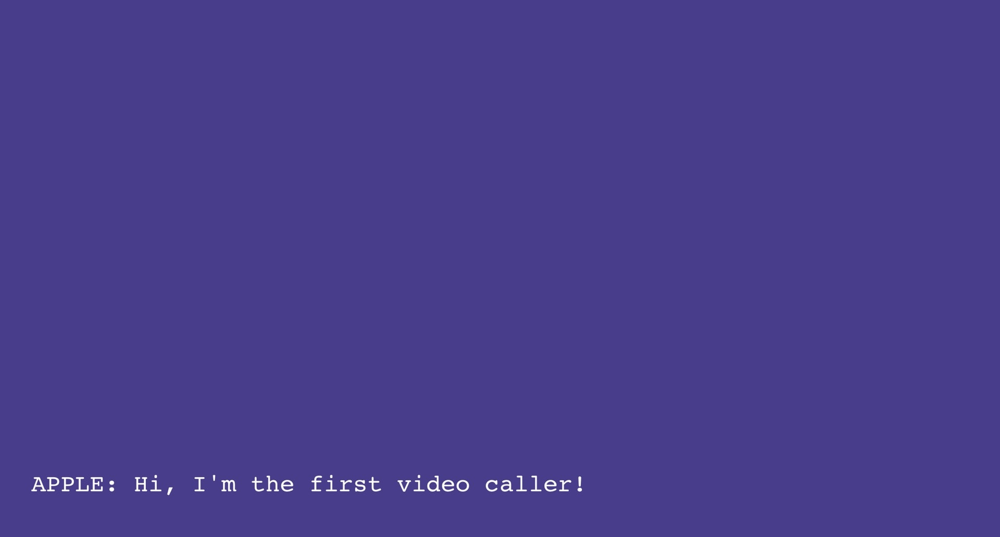

### Moderator View

The moderator view is available at `<base-url>/#moderator`. So if you are hosting the performance at `http://my-online-performance.website`, then the moderator view will be accessible via `http://my-online-performance.website/#moderator`.

Accessing the moderator view requires entering a password. The password is “butts” by default, but you can [set a different password](#modpassword).

The moderator view contains the following sections:

1. Current line: shows the current line of dialogue, along with the name of the character speaking.
2. Current choices (during an audience multiple-choice vote): shows the choices available to the audience as well as how many votes each option has, updated in real time.
3. <a id="performance-controls" aria-hidden="true"></a>Performance controls: provides the moderator with a “Next line” button to advance the performance to the next line of dialogue, and a “Start over” button which starts the performance over from the beginning.
4. Current rant content (during audience free-response): displays a bulleted list of free-response text submissions from audience members, updated in real time.

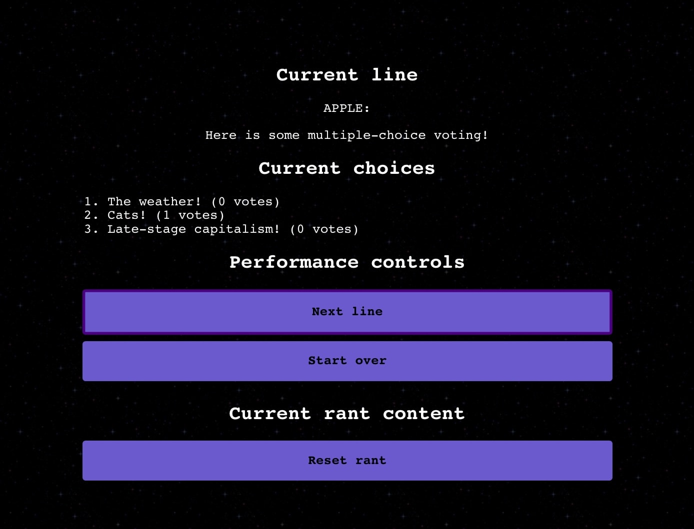

Here is an example of the moderator view during audience free-response:

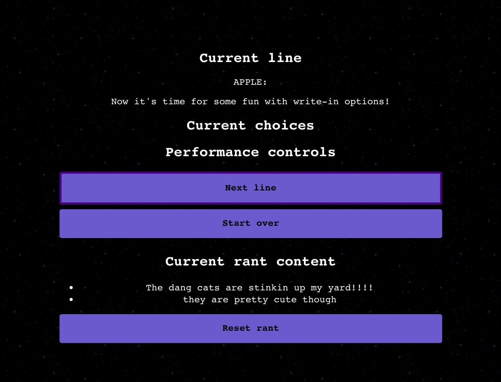

### Actor View

The actor view is available at `<base-url>/#caller`. So if you are hosting the performance at `http://my-online-performance.website`, then the actor view will be accessible via `http://my-online-performance.website/#caller`.

When `<base-url>/#caller` is first visited, the user will be prompted to select which character they are performing:

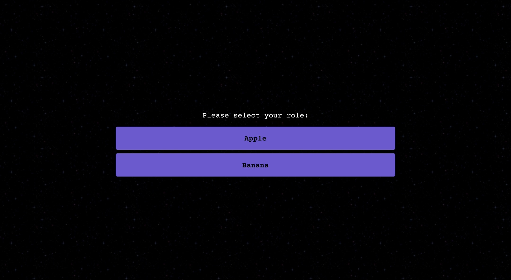

Upon choosing a role, the actor will be shown a view with two sections:

1. Current line: the topmost portion of the actor view displays either the current line of dialogue that the actor should be performing, or “--” in the case that it is the turn of a different performer to speak. If the actor is assigned to read the results of an audience free-response, the current line display will take the form of a bulleted list of audience submissions.
2. Upcoming: below the current line display is a preview of the upcoming lines for all characters.

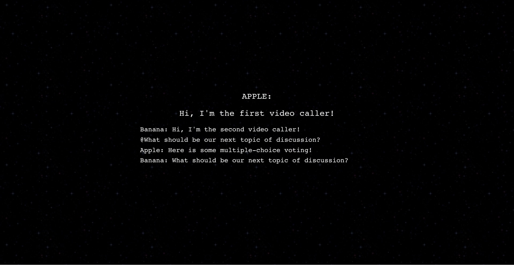

Here is an example of what the actor for the character named “Apple” sees when another character is speaking:

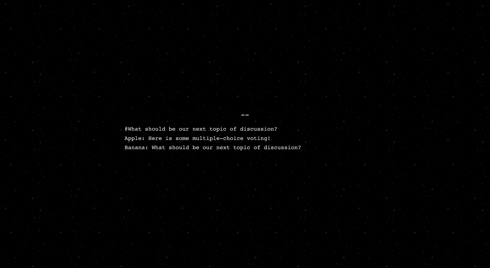

And here is an example of what the actor for the character named “Apple” sees when performing audience free-response submissions:

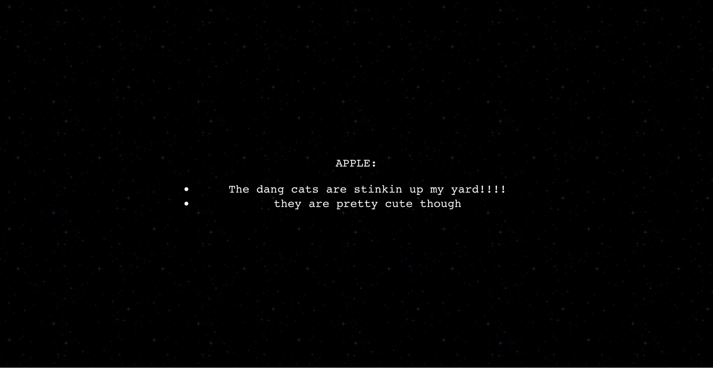

### Demonstration

Here is an example run-through of the sample script (included as `script.ink` with the Intrapology Hello World). This demo shows how the moderator view (top left), audience view (top right), and actor views (bottom left and right) change as the performance progresses:

[Demonstration of running sample script](https://github.com/user-attachments/assets/2e52d864-066f-41e6-955b-4d931011e715)

# Getting Started With the Intrapology Software

Here we will walk you through the setup needed to edit and test Intrapology performances.

## Downloading the Starter Template

The Intrapology starter template can be found at [https://github.com/squinky/intrapology-hello-world](https://github.com/squinky/intrapology-hello-world). To download the template, first click the green button labeled “Code” (circled in red below):

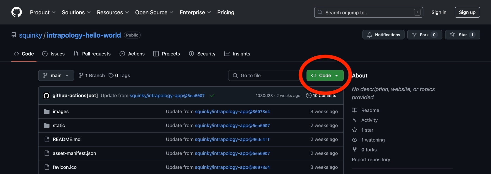

Once you have clicked the “Code” button, a box will appear below the button. At the very bottom of the box will be a link labeled “Download ZIP” (circled in red below):

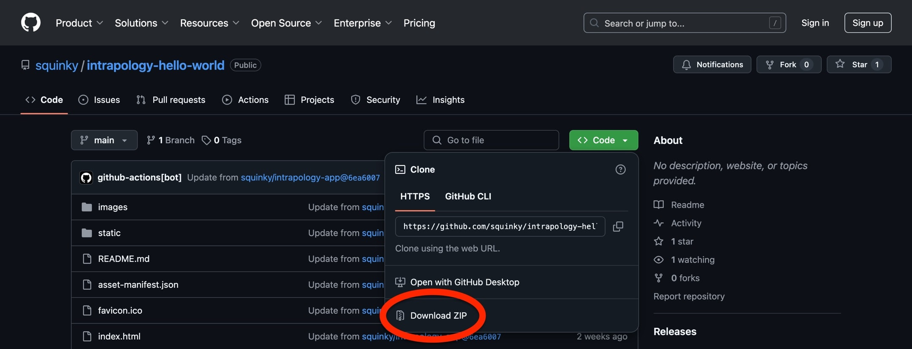

Click the “Download ZIP” link. When the ZIP file is finished downloading, extract it somewhere on your computer. For this guide it will be assumed that the folder is named “intrapology-hello-world”.

## Basic Configuration

Many aspects of your performance can be configured by editing the `settings.json` file found in the `intrapology-hello-world` folder. To get a basic starter performance up and running, we will only be going over a couple of the available options. For details on all available configuration options, go to: [Configuration (settings.json)](#configuration-settingsjson).

### Editing Settings

If you are not used to editing `.json` files, then settings.json may seem like something that only computer wizards can understand. Do not worry. `settings.json` is really just a text file with a list of settings separated by commas. You can open and edit this file with any app that can edit text (such as Notepad on Windows and TextEdit on MacOS).

In general, settings are specified in the `settings.json` file with this format:

```json
"OPTION NAME": "OPTION VALUE",
```

Open `settings.json` in a text editor of your choice, and we will take a look at a couple of important settings.

### Performance ID

The ‘ID’ of your performance is a unique name that is used to distinguish it from other performances. The performance ID is not the title of your performance that is shown to the audience. For setting the title text of your performance that will be displayed in the audience view, see [this section](#title).

The performance ID is used by the Intrapology software to keep track of the current state of your performance. This includes the current line of dialogue, and audience voting selections. It is very important that you set a unique ID for your performance. Your performance will not function as expected if it has the same ID as another performance.

By default, the performance ID is specified on line 2 of `settings.json`:

```json
"performanceId": "hello-world",
```

This line specifies that the setting called `"performanceId"` should have the value `"hello-world"`. However, it is not safe to use the default setting. Change the text `hello-world` between the quotes to something else. Make sure to use something that you are certain nobody else will choose as an ID for their performance. The longer and more particular your ID is, the better.

> [!IMPORTANT]
> Your performance ID should not contain any whitespace characters (spaces, tabs, line returns, etc).

### Character Names

The other option which must be set properly in order for your performance to work is `"callers"`. The `"callers"` setting is used to specify the names of characters which have dialogue.

> [!NOTE]
> You do not need to change the `"callers"` setting if you will be following the script writing tutorial. The characters in the tutorial script are included by default in  `settings.json`. However, it is important to know how to set character names for your own scripts.

On line 5 of `settings.json` is the following:

```json
"callers": [ "Apple", "Banana" ],
```

This specifies that there are two dialogue-speaking characters: a character named `“Apple”`, and a character named `“Banana”`. When setting your own character names, be careful to follow these formatting requirements:

1. The list of names must be surrounded by a pair of square brackets `[]`.
2. The names in the list must be separated by commas.
3. Each name must be in double quotes.
4. Each name should be capitalized exactly the same in `settings.json` and in your script.

**Examples:**

|  | Correct ✅ | Incorrect ❌ |
| --- | --- | --- |
| 1. Square Brackets around Names List | `"callers": ["Apple", "Banana"],` | `"callers": "Apple", "Banana",` |
| 2. Commas between Names | `"callers": ["Apple", "Banana"],` | `"callers": ["Apple" "Banana"],` |
| 3. Names in Double Quotes | `"callers": ["Apple", "Banana"],` | `"callers": [Apple, Banana],` |
| 4. Capitalization | `"callers": [ "Apple", "Banana" ],` in `settings.json`, `Apple` with capital “A” in script. | `"callers": [ "Apple", "Banana" ],` in `settings.json`, `apple` with lowercase “a” in script. |

## Testing a Performance on Your Computer

Our software is designed to run on a web server on the internet. But with a small bit of setup, it is possible to do test runs of performances on your own computer.

To run the Intrapology software on your computer, you will need to install a program that runs a server ‘locally’. This guide will show you how to use an app called Servez for this purpose.

To download the Servez installer, go here: [https://github.com/greggman/servez/releases/latest](https://github.com/greggman/servez/releases/latest). If you are unsure which version to download, follow these guidelines:

- If you are using Windows, download “Servez.Setup.\<version\>.exe”
- If you are using MacOS:
    - If you are using an Apple Silicon Mac, download “Servez-\<version\>-arm64.dmg”
    - If you are using an Intel Mac, download “Servez-\<version\>.dmg”
    - If you are unsure which kind of Mac you have, download “Servez-\<version\>-universal.dmg”
- If you are using Linux:
    - If you are using Ubuntu, you probably want to download "Servez_\<version\>_amd64.snap”
    - Otherwise, you probably want to download “Servez-\<version\>.AppImage”. Instructions for how to run an AppImage can be found here: [https://docs.appimage.org/introduction/quickstart.html#ref-quickstart](https://docs.appimage.org/introduction/quickstart.html#ref-quickstart).

Once installed, open Servez. Then, do the following (the image below is annotated to show where buttons are located):

1. Click the “…” button under the “Folder to Serve” heading, located near the top right corner of the app window. A file window will open. Find your `intrapology-hello-world` folder and select it.
2. Click the “Start” button, located towards the bottom left corner of the app window.
3. Click the “Launch Browser” button, located next to the “Start” button. This should open the [audience view](#audience-view-example) of the template performance in your web browser.

<p width="100%" align="center">
    <a target="_blank" href="/doc/servez_annotated.jpeg">
        
    </a>
</p>

Feel free to close Servez for now. You will not need to run it again until later in this guide. Servez will remember the Intrapology folder you selected. From now on you will only need to click “Start” and then “Launch Browser” in order to test.

## Installing Inky

To work with Intrapology performance scripts, you will need an app called Inky. To get Inky, go to this page: [https://www.inklestudios.com/ink/](https://www.inklestudios.com/ink/), and scroll down to the “Getting Started” section (pictured below). Click the appropriate download button for your computer to download the Inky installer.

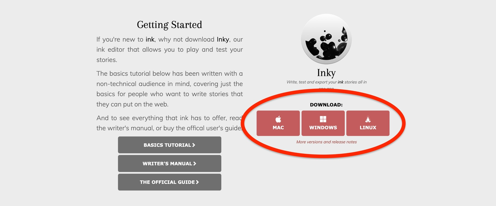

# Writing an Intrapology/Ink script

## Basics

Intrapology scripts use a format called [Ink](https://www.inklestudios.com/ink/). Ink is like the human language that you are used to writing in, but with some extra rules for grammar and punctuation. This section will walk you through the process of writing a minimal script. If you would prefer to learn by reading a list of the grammar and punctuation rules, skip to this section: [Summary](#summary).

A basic functioning Intrapology script involves the following elements:

1. [Knots](#knots)
2. [Dialogue](#dialogue)
3. [Diverts](#diverts)

which are explained in this guide.

### Setup

Open Inky. You will see the default starter Ink script contents in the editor panel (the left half of the window). Delete all text except for the line with `-> END`, then save this new script (”File” menu → “Save Project”) as `tutorial-script.ink` in your `intrapology-hello-world` folder.

> [!TIP]
> Throughout the “Writing an Intrapology/Ink script” guide, you will be instructed to add text to your tutorial script. When adding text, try to do so by typing the text yourself rather than copying and pasting. This will help your brain to process and retain the information being covered.

### Knots

Add the following line to the beginning of your script:

```
== Start
```

`==` followed by a name is a “knot heading”, which means: ‘the knot with this name begins here’. A “knot” is a piece of your script that can be referred to by name; you can think of a knot as a section or scene.

An Intrapology script needs at least one knot to function. You can name the knot anything you like in your scripts, but for this guide we use the name “Start”.

### Diverts

In order to function properly, every Intrapology script requires two special statements:

1. A statement telling the software where to begin the performance
2. A statement telling the software where to end the performance

Add the following text on its own line at the beginning of the script (before the `== Start` heading):

```
-> Start
```

In Ink, writing `->` followed by a name means: ‘now go to the knot with this name’. This is called a “divert”. Every Intrapology script must begin with a divert specifying which knot to start the performance with (even if the script only has one knot). The divert above tells the Intrapology software that your performance starts with the knot named “Start”.

The `-> END` divert present at the end of the “Start” knot tells the Intrapology software that once the “Start” knot is finished, the performance should end. Note that you do not need to have a knot named `END`. `END` is a special built-in key word which does not refer to a knot in your script.

> [!TIP]
> It is best that whenever you add a new knot to your script, you are sure to do the following:
> 1. End the knot with a divert either to `END` or to another knot.
> 2. Consider which other knot(s), if present, should divert to this new knot. Then add the associated diverts as soon as possible
> 
> This will reduce the likelihood of unexpected problems later.

Your script file should look like this now:

```
-> Start

== Start

-> END
```

Without any content, this is not a very interesting script. Luckily, adding dialogue is the next order of business.

### Dialogue

To add some dialogue to the script, add the following at a new line under the `== Start` heading and before the `-> END` divert:

```
Apple: Hi, I'm the first video caller!
Banana: Hi, I'm the second video caller!
```

Writing the name of a character (in this case `Apple` or `Banana`), followed by a colon `:`, followed by some text, means: ‘the character with this name says this text’. When each line of dialogue is reached during a performance, the Intrapology interface will show it to the relevant performer. The [Subtitles View](#subtitles-view) will show the line of dialogue as well. The moderator view also displays the current line of dialogue.

> [!WARNING]
> Remember: all characters with dialogue in your script must be listed via the [`"callers"`](#callers)[ option](#callers) in `settings.json`. Since `“Apple”` and `“Banana”` are specified by default in the Intrapology Hello World template, no action is required for for now. However, if you write a script with different character names, you will need to update `settings.json`.

At this point, the contents of your script file should look like this:

```
-> Start

== Start

Apple: Hi, I'm the first video caller!

Banana: Hi, I'm the second video caller!

-> END
```

This is enough to use for a trial run with the Intrapology software.

### Running the Performance Locally

If you have not already done so, [set a unique Performance ID](#performance-id) and [install and set up Servez](#testing-a-performance-on-your-computer) before continuing.

1. First you need to ‘export’ the script to a file format that the Intrapology software can use. To do so, go to the “File” menu and click the item labelled “Export to JSON…”. Name the exported file `script.json` (make sure you aren’t using the default name `script.ink.json`) and save it in your `intrapology-hello-world` folder.
2. Open Servez and click the “Start” button.
3. Click the “Launch Browser” button, which will open the Audience View in your web browser. Make a note of the URL in the address bar (it will be something like `localhost:8080`), you will need it for the next step. It will be referred to from here on as `<base url>`.
4. Go to the following additional pages, each in a separate web browser window:
    1. Go to `<base-url>/#caller` and select “Apple”
    2. Go to `<base-url>/#caller` and select “Banana”
    3. Go to `<base-url>/#moderator` and enter the default password, ”butts”, unless you have changed the password to something else.

You should now be able to use the Moderator View to step through the performance so far. Here is a screen recording of what this should look like (minus the Audience View):

https://github.com/user-attachments/assets/1721c86d-7c13-4c4b-9b25-72184527fd98

When you are ready to move on, simply close the browser windows, click the “Stop” button in Servez, and exit Servez.

## Interactivity

The key elements of building interactive performances are:

1. [Multiple-Choice Audience Input](#multiple-choice-audience-input)
2. [Flow and Choice Branching](#flow-and-choice-branching)
3. [Gathers](#gathers)
4. [Free-Response Audience Input](#free-response-audience-input)
5. [Variables](#variables)

### Multiple-Choice Audience Input

After this line:

```
Banana: Hi, I'm the second video caller!
```

and before the `-> END`, add the following to your script:

```
== MultipleChoice

@What should be our next topic of discussion?

Apple: Here is some multiple-choice voting!

Banana: What should be our next topic of discussion?

* Apple: The weather!
* Apple: Cats!
* Apple: Late-stage capitalism!
```

(After this change, you will likely see a ⚠️ symbol at the left edge of the Inky window. We will deal with this shortly.)

To have an audience multiple-choice vote, a script must have the following:

1. A block of text prefixed with the `@` symbol. This text will be shown to the audience at the top of [the audience view](#audience-view) UI during the voting period. The placement of this block of text determines when the audience vote UI becomes visible.
2. A set of choices for the audience to vote on. An `@` block will be associated with the closest group of choices below the `@` text. A choice is prefixed with the `*` symbol. Each choice should be on its own line.

During a performance, the audience will be presented with the choice UI once the `@` has been reached. When this happens, a title with the text "What should be our next topic of discussion?" will be displayed, as will 3 buttons, each having, respectively, the following text:

- "Apple: The weather!"
- "Apple: Cats!"
- "Apple: Late-stage capitalism!"

The choice with the most votes becomes the next line of dialogue for the character `Apple`.

> [!NOTE]
> The voting UI will remain visible to the audience until the choice group has been reached.

> [!TIP]
> You can use `*` or `+` for choices. For Intrapology these two options have the same meaning. But in other uses of Ink, `*` and `+` work differently. We recommend using `*` in general, since it works the same in both Ink and Intrapology, whereas `+` has a special meaning outside of Intrapology.

### Flow and Choice Branching

At this point we need to discuss the concepts of **flow** and **choice branching**.  'Flow' is a term used to describe the path taken through an Ink/Intrapology script. The script itself is a static document in which all content is present at once. But a live performance proceeds (flows) through the script one bit at a time. The flow of a performance is the collection of sequenced steps through the source script. Before adding the multiple choice section, we had written a script with a single possible flow. The sequence of steps in a performance of the script would have been the same every time. However, with the addition of audience choices, we now have a script which has more than one possible flow. When the audience selects a choice, the performance flow will follow a 'branch' for that choice. The diagram below visualizes the diverging possible flows of the script:

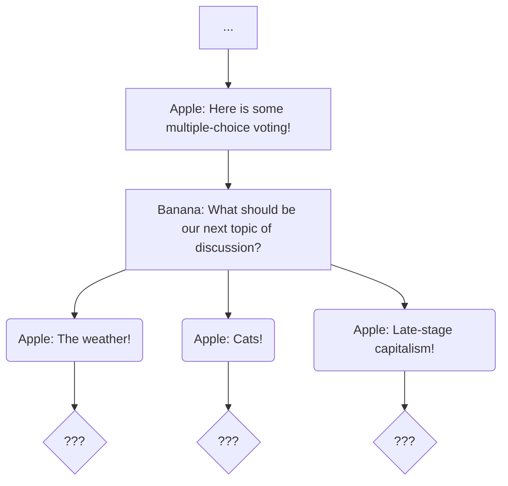
```mermaid
graph TD
  ... --> A[Apple: Here is some multiple-choice voting!]
  A --> B[Banana: What should be our next topic of discussion?]
  B --> C(Apple: The weather!)
  B --> D(Apple: Cats!)
  B --> E(Apple: Late-stage capitalism!)
  C --> F{???}
  D --> G{???}
  E --> H{???}
```

The diagram shows each choice branch leading to a different "???". There are two important points which need to be noted here:

- With Ink/Intrapology scripts, each individual choice is the start of its own branch of the flow. Each choice leads to a next step which is distinct from the steps of its 'sibling' choices. This is why the diagram shows each choice having its own outgoing arrow. What comes after a choice is the content written between that choice and the next choice. An example of this will be given shortly.
- Each choice leads to a next step, but our script so far does not specify what happens next for any of the choices. Any choice which does not lead to anything else is a dead end, which is not allowed. Such a choice leads to a scenario where the flow has nowhere left to go, even though an `-> END` divert has not been reached. So it is required to specify what should happen after each choice. Every choice must be followed by *something*, even if that something is simply `-> END`. Luckily, Inky will display a warning when there is a choice which leads to a dead end.

> [!NOTE]
> Ink requires that every possible user flow leads to a `-> END`. In cases where flow can run out before a `-> END`, Inky will highlight the relevant line of text with a ⚠️ symbol on the left edge of the window. This warning message will be included: “Apparent loose end exists where the flow runs out.”

To appease the computer, we can amend our recently added group of choices like so:

```
* Apple: The weather!
  -> END
* Apple: Cats!
  -> END
* Apple: Late-stage capitalism!
  -> END
```

> [!TIP]
> Choice branch content does not need to be indented (as it is in the above snippet). However the use of indentation can make the script easier to read at a glance.

Now the performance will properly end if any of the listed choices are selected. The diagram below depicts the flow options for this updated script:

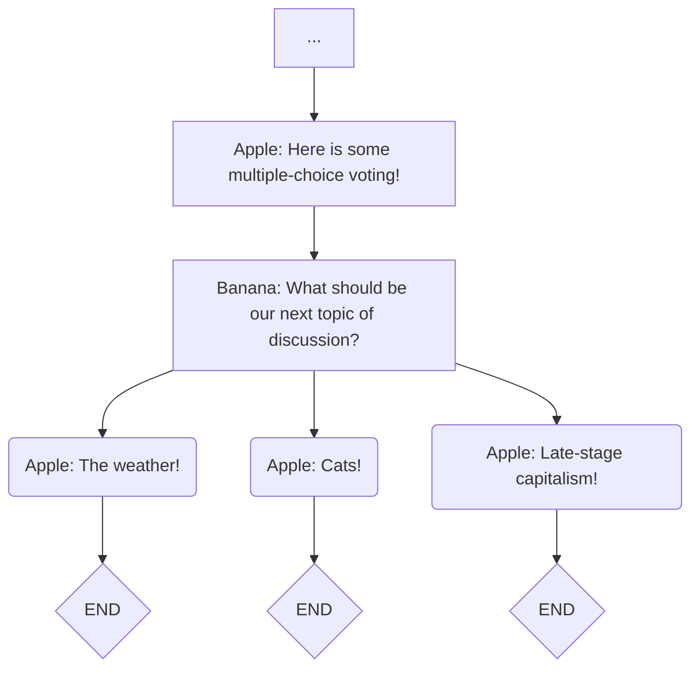
```mermaid
graph TD
  ... --> A[Apple: Here is some multiple-choice voting!]
  A --> B[Banana: What should be our next topic of discussion?]
  B --> C(Apple: The weather!)
  B --> D(Apple: Cats!)
  B --> E(Apple: Late-stage capitalism!)
  C --> F{END}
  D --> G{END}
  E --> H{END}
```

Content directly below a choice indicates what should come after that choice. Completely unique branches can be written this way. For example, with the following (do not add this to your script):

```
* Apple: The weather!
  Banana: Its lovely right now!
  -> SomeKnot
* Apple: Cats!
  Banana: Some of my best friends are cats.
  -> SomeOtherKnot
* Apple: Late-stage capitalism!
  Banana: All that was solid has melted into air.
  -> YetAnotherKnot
```

it would be the case that if the `Apple: Cats!` line is selected, the performance would next proceed with the line `Banana: Some of my best friends are cats.`, and then the performance would divert to the knot titled `SomeOtherKnot`. The content for the other two choices would not be included in that performance.

### Gathers

Writing shared outcomes for groups of choices can be tiresome when having to write the same thing after each choice. For these kinds of situations, Ink provides something called a 'gather'. Instead of having a dedicated `-> END` after each choice, write the following:

```
* Apple: The weather!
* Apple: Cats!
* Apple: Late-stage capitalism!

- -> END
```

Placed after a set of choices, the `-` symbol followed by space and then some content is a **gather**, which has the meaning: 'after the flow from any choice branch of the above group has concluded, the following content is next'. You can think of a gather as a way of 'un-branching' back to a singular flow sequence after a set of choices has branched the flow. With the use of a gather, the flow can now be represented by this diagram:

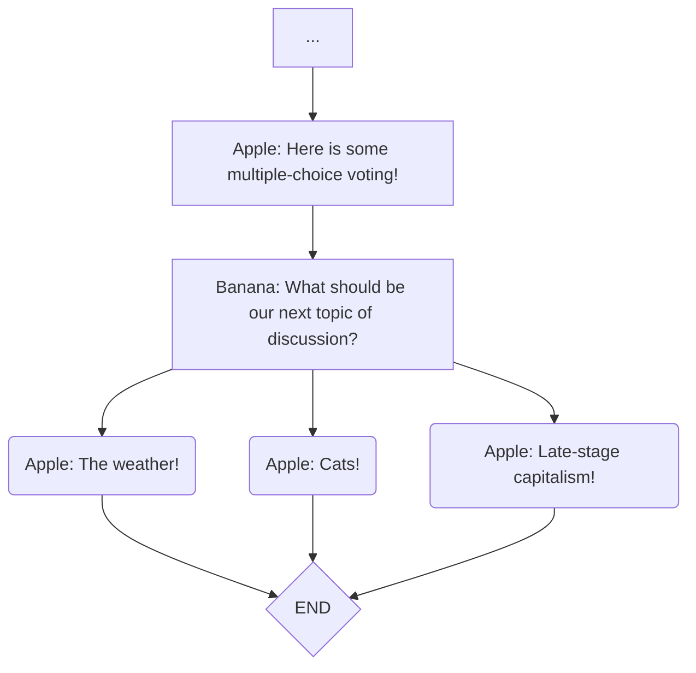
```mermaid
graph TD
  ... --> A[Apple: Here is some multiple-choice voting!]
  A --> B[Banana: What should be our next topic of discussion?]
  B --> C(Apple: The weather!)
  B --> D(Apple: Cats!)
  B --> E(Apple: Late-stage capitalism!)
  C --> F{END}
  D --> F
  E --> F
```

Diverts and dialogue are both legal kinds of content for a gather.

### Free-Response Audience Input

The Intrapology software also offers a way to collect ‘free-response’ style audience input and incorporate it into a performance.

First, replace this line (at the end of the “MultipleChoice” knot):

```
- -> END
```

With this:

```
- -> WriteIn
```

Next, add the following to the end of your script:

```
== WriteIn

@Write any thoughts you have about the topic here.

Apple: Now it's time for some fun with write-in options!

Banana: The audience is going to type stuff in and you are going to read it all!

Apple: That's right!

Apple: Firebase-read

+ z

Banana: That's all, folks!

-> END
```

In a knot with an `@`-prompt line and a line of dialogue with the exact text: `Firebase-read`, the audience will be prompted to write whatever they would like into a text box. Once the `CHARACTER: Firebase-read` line is reached, the relevant performer will be shown a list of the responses from each audience member. In this instance, audience members would be presented with the prompt “Write any thoughts you have the topic here.”, and the performer for “Apple” will be shown the audience responses.

> [!NOTE]
> The write-in prompt will remain visible until another audience input line is reached. This is why we have added `+ z` (a fake choice which the audience will not be presented with): to cause the write-in prompt to go away before the next line.

### Variables

Another important element of dynamic performances is a set of functionality relating to ‘Variables’. Variables are like boxes that can be used to hold information. Variables have names, allowing to you keep information organized. Existing variables can have new information put in them, so they are a great way to keep track of and use information that depends on audience input or random events. 

**Creating Variables**

Add the following to the very beginning of your script (before the `-> Start`):

```
VAR topic = "nothing"
VAR excitementLevel = 1
```

There are several things to note here:

- `VAR someVariable = 0` tells the computer that you would a variable named “someVariable” to exist, and that it should start out containing the value `0`.
- Variable names cannot contain spaces. “excitement level” is not a legal name for a variable.
- Variables must be created before they can be used. If you try to use the variable named “topic” on a line before `VAR topic = ...` has been specified, the computer will not know what to do.
- Variables can store different kinds of information, such as text (which must between double quotes), numbers and .

**Using Information Stored in Variables**

Replace this line (in the “WriteIn” knot):

```
@Write any thoughts you have about the topic here.
```

with this:

```
@Write any thoughts you have about {topic} here.
```

In a line of text, placing the name of a variable between curly brackets (`{` and `}`) tells Ink/Intrapology to insert whatever is stored in the variable at that part of the line. So when running a performance of the script so far, when the line we have just added is reached, the audience will be presented with “Write any thoughts you have about nothing here.”, since the variable named `topic` has been given the value “nothing”. This can be used in a line of dialogue as well.

**Updating Variables**

Right below this line (near the top of your script):

```
VAR excitementLevel = 1
```

add the following line:

```
~ excitementLevel = 2
```

`~` followed by the name of a variable which has previously been created, followed by `=` and a value tells the computer to replace the current value contained in the variable with a new one. In this case, `excitementLevel` contains the value `1` until we update it with `2` on the line below. For the rest of the script, the value contained in `excitementLevel` is 2. Since this example is somewhat abstract, it is likely not yet clear what the purpose for doing this is, but the next example will show a specific practical use case for setting variable values.

Modify the choice group found in the “MultipleChoice” knot:

```
* Apple: The weather!
* Apple: Cats!
* Apple: Late-stage capitalism!
```

so that it is like this:

```
* Apple: The weather!
    ~ topic = "the weather"
* Apple: Cats!
    ~ topic = "cats"
* Apple: Late-stage capitalism!
    ~ topic = "late-stage capitalism"
```

Note that now information is being stored in the `topic` variable which depends on the result of the audience vote. With this change, the contents of the prompt for this line:

```
@Write any thoughts you have about {topic} here.
```

will depend on what the audience has voted for earlier in the performance. Storing differing values in a variable depending on the selected choice branch, and then using that variable later in the script, is a technique which can increase the degree to which a performance changes in response to audience input. For example, you can also incorporate variables into dialogue, like this:

```
Banana: All I've been able to think about lately is {topic}.
```

Variables can also be used for much more. To learn about the more advanced uses of variables, read this section of the official Ink documentation: [https://github.com/inkle/ink/blob/master/Documentation/WritingWithInk.md#1-global-variables](https://github.com/inkle/ink/blob/master/Documentation/WritingWithInk.md#1-global-variables).

## Conclusion

Your script should now look like this:

```
VAR topic = "nothing"
VAR excitementLevel = 1
~ excitementLevel = 2

-> Start

== Start

Apple: Hi, I'm the first video caller!

Banana: Hi, I'm the second video caller!

-> MultipleChoice

== MultipleChoice

@What should be our next topic of discussion?

Apple: Here is some multiple-choice voting!

Banana: What should be our next topic of discussion?

* Apple: The weather!
    ~ topic = "the weather"
* Apple: Cats!
    ~ topic = "cats"
* Apple: Late-stage capitalism!
    ~ topic = "late-stage capitalism"

- -> WriteIn

== WriteIn

@Write any thoughts you have about {topic} here.

Apple: Now it's time for some fun with write-in options!

Banana: The audience is going to type stuff in and you are going to read it all!

Apple: That's right!

Apple: Firebase-read

+ z

Banana: That's all, folks!

->END
```

## Summary

- Knots: `== Start` is a “knot heading”, which means ‘the knot (section) named `Start` begins here’. To learn more, go here: [https://github.com/inkle/ink/blob/v.1.2.0/Documentation/WritingWithInk.md#3-knots](https://github.com/inkle/ink/blob/v.1.2.0/Documentation/WritingWithInk.md#3-knots)
- **Dialogue**: `Apple: Hi, I'm the first video caller!`  means ‘the character named `Apple` says “Hi, I’m the first video caller!”’. This will be shown to the performer for the Apple character via their [Actor View](#actor-view) .
- **Diverts**: `-> Start` means ‘go to the knot named `Start`’
    - You must begin your script with a divert telling Intrapology which knot to go to first.
    - You must have at least one `-> END` divert telling Intrapology where the performance ends. Inky will warn you if you are missing this.
    - To learn more, go here: [https://github.com/inkle/ink/blob/v.1.2.0/Documentation/WritingWithInk.md#4-diverts](https://github.com/inkle/ink/blob/v.1.2.0/Documentation/WritingWithInk.md#4-diverts)
- **Multiple-choice Audience Input**:
    
    ```
    @What should be our next topic of discussion?
    
    * Apple: The weather!
    * Apple: Cats!
    * Apple: Late-stage capitalism!
    ```
    
    means ‘show the audience a choices box’ which
    
    - Is labeled “What should be our next topic of discussion?”
    - Has the following options to vote for the next line of dialogue: `Apple: The weather!`, `Apple: Cats!`, and `Apple: Late-stage capitalism!`
    
    The option which receives the most votes will be shown to the performer for “Apple”.
    
    To learn more, go here: [https://github.com/inkle/ink/blob/v.1.2.0/Documentation/WritingWithInk.md#2-choices](https://github.com/inkle/ink/blob/v.1.2.0/Documentation/WritingWithInk.md#2-choices)
    
- **Free-Response Audience Input**:
    
    ```
    @Write any thoughts you have about cats here.
    
    Apple: Firebase-read
    ```
    
    In a knot with an `@`-prompt line and a line of dialogue with the exact text: `Firebase-read`, the audience will be prompted to write whatever they would like into a text box. Once the `CHARACTER: Firebase-read` line is reached, the relevant performer will be shown a list of the responses from each audience member.
    
- **Variables**:
    - **Creating a variable**: `VAR topic = "nothing"`  means ‘create a variable named `topic` which for now has the value `"nothing"`'.
    - **Changing the value of a variable**: `~ topic = "cats"` means ‘the variable named `topic` now has the value `"cats"`'.
    - **Including the value of a variable**: `{topic}` means insert the current value of the variable named `topic` here’. This works in dialogue as well as audience prompts and choices.
    - Example:
        
        ```
        VAR topic = "nothing"
        
        ~ topic = "cats"
        
        Apple: I can't stop thinking about {topic}!
        ```
        
        When the line of dialogue above is reached during a performance, the performer for “Apple” will be shown the line: “I can't stop thinking about cats!”.
        
        To learn more, go here: [https://github.com/inkle/ink/blob/v.1.2.0/Documentation/WritingWithInk.md#part-3-variables-and-logic](https://github.com/inkle/ink/blob/v.1.2.0/Documentation/WritingWithInk.md#part-3-variables-and-logic)
        
- **Gathers**:
    - After a group of choices, `- -> SomeKnot` means ‘after a choice is selected, go to the knot named `SomeKnot`’.
    - A gather does not have to include a divert. You can also use a gather for a line of dialogue after choices, for example: `- Apple: Let's move on.`
    - To learn more, go here: [https://github.com/inkle/ink/blob/v.1.2.0/Documentation/WritingWithInk.md#part-2-weave](https://github.com/inkle/ink/blob/v.1.2.0/Documentation/WritingWithInk.md#part-2-weave)

# Additional Technical Topics

## Configuration (`settings.json`)

> [!IMPORTANT]
> Configuration items tagged with **[REQUIRED]** must be changed from their default values in order for your performance to work as expected.

### **performanceId**

**[REQUIRED]**

A unique name for your performance. Should not include spaces. Make sure this is something that another performance will not be likely to use (for example, something generic like “performance” or “my-performance” is a bad idea).

### **modPassword**

The password required for access to the moderator view of the app. This is currently set to `"butts"` by default. You do not have to change this for the software to function, but it is probably a good idea to set a different password before running a live performance.

### **title**

A title for your performance that will be displayed to the audience in the performance UI.

### **callers**

**[REQUIRED]**

The names of the characters in your play who will be performed by human actors, in JSON array format: a pair of square brackets `[]` containing a list of names, with each name in double quotes and separated by commas. For example, if your performance has three characters named Ophelia, Rosencrantz, and Guildenstern, then the value for `"callers"` should be `["Ophelia", "Rosencrantz", "Guildenstern"]`.

### **videoCallEmbedLink**

The YouTube URL for your performance video stream.

### **styles**

Change colours, fonts, and backgrounds here. For a list of available options with examples, go to this section: [Customizations to Visual Presentation (`settings.json` styles)](#customizations-to-visual-presentation-settingsjson-styles).

### **defaultAudienceMessage**

The placeholder message to be displayed to the audience when there is no audience vote or free-response occurring.

## Customizations to Visual Presentation (`settings.json` styles)

The following options are available for customizing the look of the Intrapology UI (follow the ‘type’ link for information about the type of data allowed for that option):

### **desktopBackground**

**Type:** [Background](#background)

This determines the background color/image for the [main area of the Audience View](#audience-view-main). By default this is set to an animated image of flickering stars.

Here is an example of what the Audience View UI looks like when `desktopBackground` has been set to “fuchsia”:

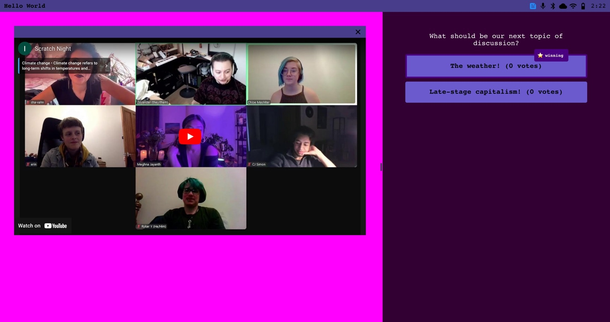

### **interactBackground**

**Type:** [Background](#background)

This determines the background color/image for the [audience input area of the Audience View](#audience-input). By default this is set to a slightly transparent black.

Here is an example of what the Audience View UI looks like when `interactBackground` has been set to “fuchsia”:

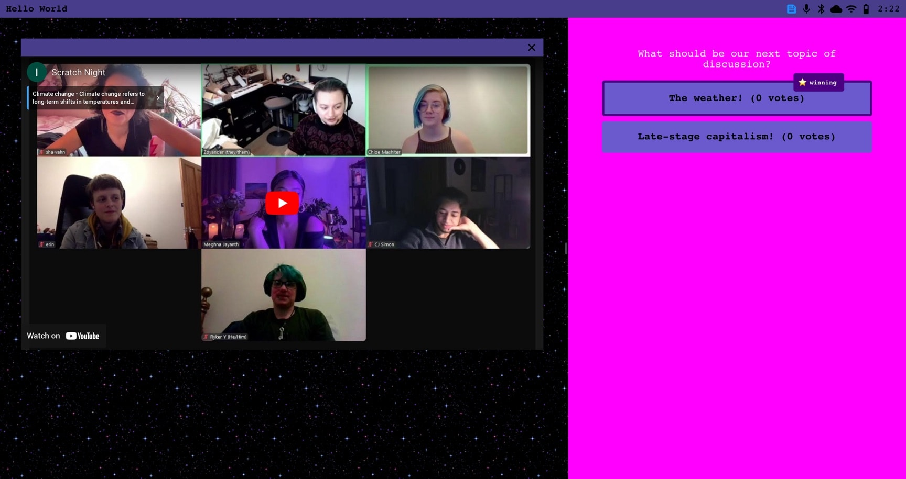

### **mainFont**

**Type:** [Font](#font)

This determines the font for all text in the UI except for subtitles. By default this is set to “Courier”.

Here is an example of what the Audience View UI looks like when `mainFont` has been set to “cursive”:

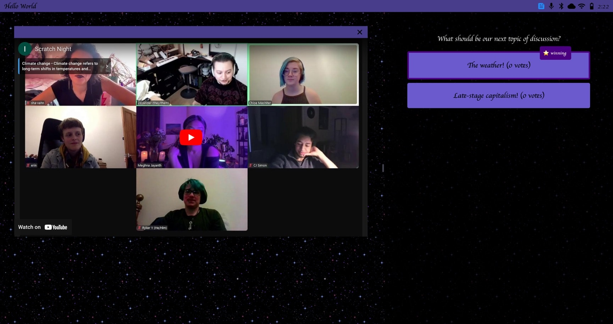

### **mainTextColor**

**Type: **[Color](#color)

This determines the color for:

- Audience View:
    - Input prompt text
    - Input area placeholder text
- Moderator View:
    - All non-button text
- Actor View:
    - Current line text

By default this is set to “white”.

Here is an example of what the Audience View UI looks like when `mainTextColor` has been set to “fuchsia”:

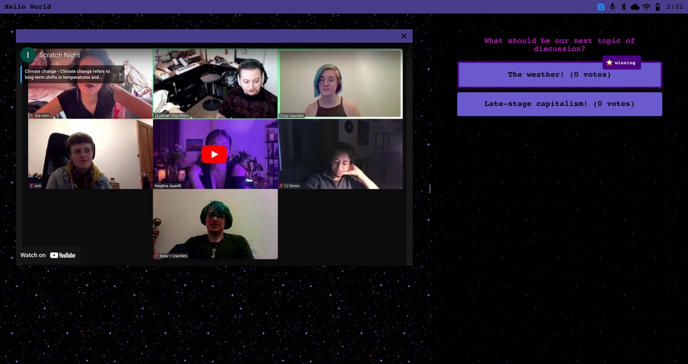

### **taskbarBackground**

**Type: **[Background](#background)

This determines the background for the bar at the top of the Audience View UI, as well as the bar on top of the video feed box. By default this is set to “darkslateblue”.

Here is an example of what the Audience View UI looks like when `taskbarBackground` has been set to “fuchsia”:

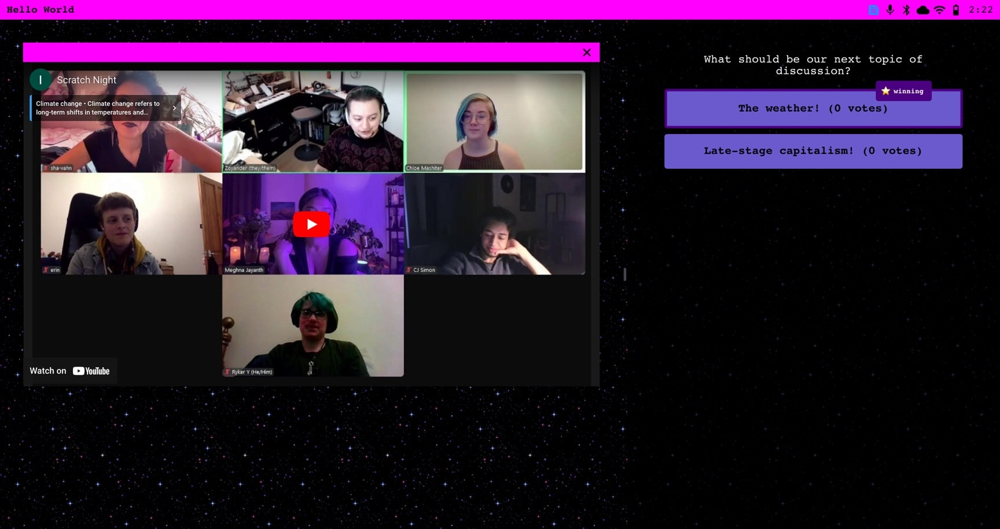

### **taskbarTextColor**

**Type: **[Color](#color)

This determines the color for all text and icons in the taskbar at the top of the Audience View, except for the leftmost icon. By default this is set to “black”.

Here is an example of what the Audience View UI looks like when `taskbarTextColor` has been set to “fuchsia”:


### **taskbarHighlightColor**

**Type: **[Color](#color)

This determines the color for leftmost icon in the taskbar at the top of the Audience View. By default this is set to “dodgerblue”.

Here is an example of what the Audience View UI looks like when `taskbarHighlightColor` has been set to “fuchsia”:


### **buttonBackground**

**Type: **[Background](#background)

This determines the background for all buttons in the UI. By default this is set to “slateblue”.

Here is an example of what the Audience View UI looks like when `buttonBackground` has been set to “fuchsia”:

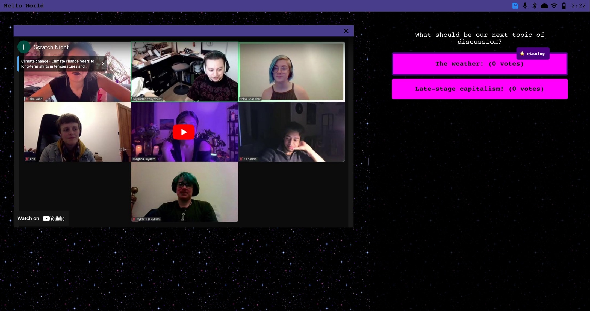

### **buttonBackgroundHover**

**Type: **[Background](#background)

This determines the background for any button that the mouse is hovering over. By default this is set to “dodgerblue”.

Here is an example of what the Audience View UI looks like when `buttonBackgroundHover` has been set to “fuchsia” and the user’s mouse is hovering over the button labelled “The weather! (0 votes)”:

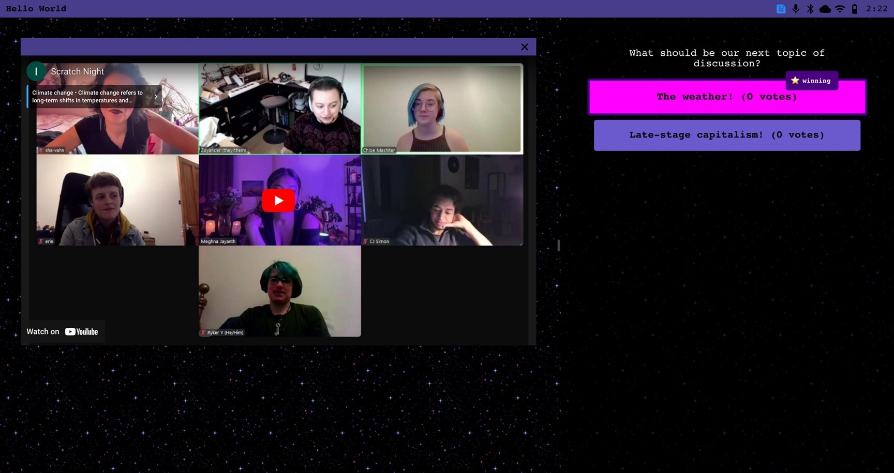

### **buttonTextColor**

**Type:** [Color](#color)

This determines the text color for all buttons in the UI. By default this is set to “black”.

Here is an example of what the Audience View UI looks like when `buttonTextColor` has been set to “fuchsia”:


### **mainHighlightBackground**

**Type:** [Color](#color)

This determines the background color for the “⭐️ winning” tag in the multiple choice mode of the Audience View UI. By default this is set to “indigo”.

Here is an example of what the Audience View UI looks like when `mainHighlightBackground` has been set to “fuchsia”:

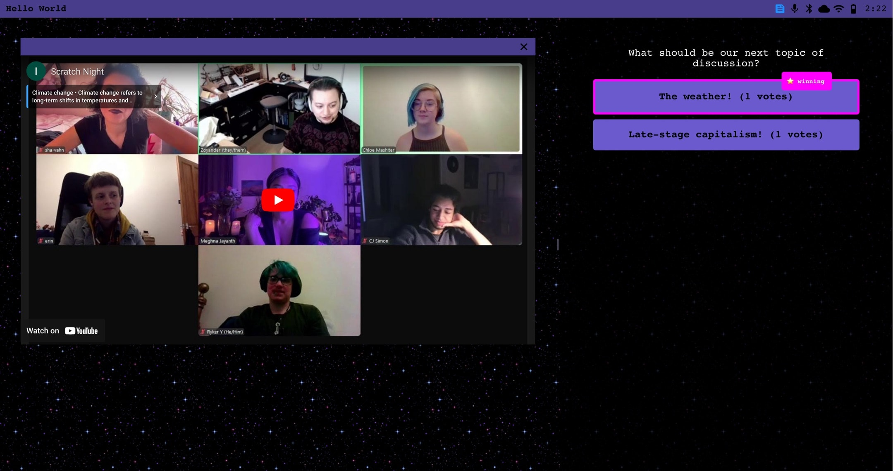

### **altHighlightBackground**

**Type: **[Background](#background)

This determines the background color for the “✅ selected” tag in the multiple choice mode of the Audience View UI. By default this is set to “midnightblue”.

Here is an example of what the Audience View UI looks like when `altHighlightBackground` has been set to “fuchsia”:


### **highlightTextColor**

**Type: **[Color](#color)

This determines the text color for the “⭐️ winning” and “✅ selected” tags in the multiple choice mode of the Audience View UI. By default this is set to “white”.

Here is an example of what the Audience View UI looks like when `highlightTextColor` has been set to “fuchsia”:

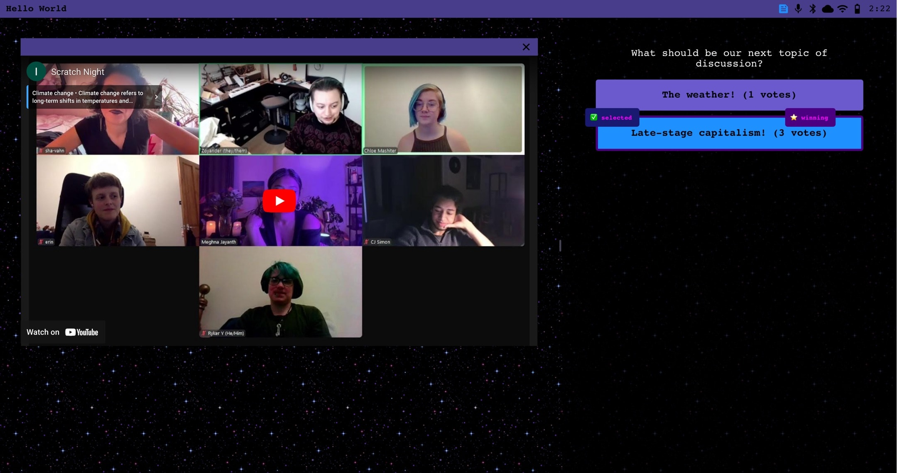

### **subtitlesBackground**

**Type: **[Background](#background)

This determines the background for the Subtitles View. By default this is set to “darkslateblue”.

Here is an example of what the Subtitles View UI looks like when `subtitlesBackground` has been set to “fuchsia”:

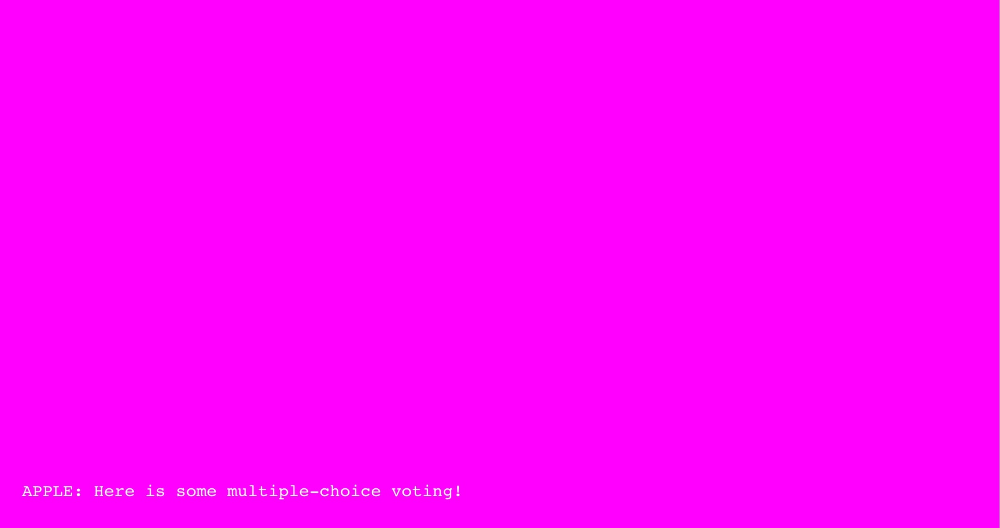

### **subtitlesTextColor**

**Type: **[Color](#color)

This determines the text color for the Subtitles View. By default this is set to “white”.

Here is an example of what the Subtitles View UI looks like when `subtitlesTextColor` has been set to “fuchsia”:


# Other

## CSS Glossary

### Color

There are several ways to specify a color.

**Named Colors**

The simplest method for specifying a color is to use a name, for example:

```json
"mainTextColor": "blue",
```

A list of available color names can be found here: [https://developer.mozilla.org/en-US/docs/Web/CSS/named-color#standard_colors](https://developer.mozilla.org/en-US/docs/Web/CSS/named-color#standard_colors)

**RGB**

Colors can also be specified in terms of red, green, and blue intensity percentages (RGB), like this:

```javascript
rgb(RED INTENSITY, GREEN INTENSITY, BLUE INTENSITY)
```

With this approach, the color is derived by mixing the three primary colors, set to certain intensities. An intensity of 0% for a primary color means that it contributes nothing to the final result. If all three primary colors are set to 0% intensity, then you get black: `rgb(0%, 0%, 0%)` is equivalent to the named color `"black"`. If all three primary colors are set to 100% intensity, then you get white: `rgb(100%, 100%, 100%)` is equivalent to the named color `“white”`. Setting the intensities of two of the primary colors to 0%, and then setting the intensity of the remaining primary color to something greater than 0%, will give you a shade of that primary color: `rgb(0%, 90%, 0%)` is a bright green, whereas `rgb(0%, 20%, 0%)` is a dark green. Nearly any color imaginable can be described this way. For example, to set the main text color of the Intrapology UI to a mild purple, you could specify a mix of: red at 60% intensity, green at 0% intensity, and blue at 50% intensity with the following:

```json
"mainTextColor": "rgb(60%, 0%, 50%)",
```

You can read more about the CSS `rgb` function here: [https://developer.mozilla.org/en-US/docs/Web/CSS/color_value/rgb](https://developer.mozilla.org/en-US/docs/Web/CSS/color_value/rgb)

**Hex**

Colors can be specified via what is known as “hexadecimal” format. This can be useful if you are using a software tool to pick colors (such as this: [https://www.hexcolortool.com/#c3ff00](https://www.hexcolortool.com/#c3ff00)) and the given software provides the hex value of a color you have selected. For more information about the hex format go here: [https://developer.mozilla.org/en-US/docs/Web/CSS/hex-color](https://developer.mozilla.org/en-US/docs/Web/CSS/hex-color).

**Further Reading**

This article provides a technical overview of the various ways that colors can be described: [https://developer.mozilla.org/en-US/docs/Web/CSS/color_value](https://developer.mozilla.org/en-US/docs/Web/CSS/color_value)

### Font

The font for a given setting is specified as a list of one or more comma-separated font names. The first font in the list (in left to right order) found on the device viewing the UI will be used. For example, when given the following:

```json
"mainFont": "Arial, Helvetica, sans-serif",
```

the web browser being used to view the Intrapology UI will first try to use Arial for the main font. If Arial is not found, then the browser will look for Helvetica. If Helvetica is not available either, then the default sans serif font for the browser will be used.

**Generic Fonts**

The most basic kind of font that can be chosen is a ‘generic’ font. Generic font names refer to general categories, leaving it up to the web browser to decide the exact font to use within that category. It is usually a good idea to include a generic font name as the last item in a list of font options, in case none of the other fonts specified are available. The generic font names are:

- “serif”
- “sans-serif”
- “monospace”
- “cursive”
- “fantasy”

Examples of each category can be found here: [https://developer.mozilla.org/en-US/docs/Learn_web_development/Core/Text_styling/Fundamentals#web_safe_fonts](https://developer.mozilla.org/en-US/docs/Learn_web_development/Core/Text_styling/Fundamentals#web_safe_fonts)

**Web Safe Fonts**

There is a small set of fonts which are present on nearly all modern devices, making them reliable choices for non-generic backup options. You can find these listed here: [https://developer.mozilla.org/en-US/docs/Learn_web_development/Core/Text_styling/Fundamentals#web_safe_fonts](https://developer.mozilla.org/en-US/docs/Learn_web_development/Core/Text_styling/Fundamentals#web_safe_fonts)

**Custom Fonts**

Here is a quick guide to using a custom font:

1. Go to [fonts.google.com](https://fonts.google.com/) and find a font that you like. This guide will refer to this font: [https://fonts.google.com/specimen/Libre+Baskerville](https://fonts.google.com/specimen/Libre+Baskerville), but the process will be the same for any other font.
2. On the page for the font you have selected, click the “Get font” button in the upper right corner of the view.
3. Make sure that the text at the top of the page says "1 font family selected”. If the number selected is greater than one you may have accidentally selected multiple fonts. In such a case you will want to use the trash bin icon next to any extraneous fonts to remove those from the selection list.
4. Click the “Get embed code” button on the right-hand edge of the page.
5. On the “Embed code” page, the right-hand portion of the view will have a pair of buttons labelled “\<link\>” and “@import”. “\<link\>” is selected by default, select “@import” instead.
6. There will be a box labelled “\<Font Name\>: CSS classes”. Inside the box will be some text, you can ignore most of it, but take a note of the first line you see which begins with “font-family: “. This line will show you how to refer to the font by name in `settings.json`. For Libre Baskerville, the line in question is: `font-family: "Libre Baskerville", serif;`. The bit to write down somewhere is the font name in between quotes (e.g. ”Libre Baskerville”)
7. There will be a box labelled “Embed code in the \<head\> of your html”. Inside the box will be a button labelled “Copy code”: click this button.
8. Open `intrapology-hello-world/index.html` in a text editor. Right between this bit of text: `<!doctype html><html lang="en"><head>` (found at the very beginning of the file) and this bit of text: `<meta charset="utf-8"/>`, paste the code that was copied during the previous step. Make sure to save this change to the file.
9. Open `intrapology-hello-world/settings.json` and add the font name from step 6 to the beginning of the list of fonts. Make sure that you use single quotes instead of double quotes. For example, if adding Libre Baskerville the whole line in `settings.json` should be: 
    
    ```
    "mainFont": "'Libre Baskerville', Courier, 'Courier New', monospace",
    ```
    

### Background

CSS background is a rather large topic, only a small example of what is possible will be given here.

The simplest possible background can be set by providing any legal CSS color value, for example:

```json
"taskbarBackground": "blue",
```

You can also specify a url for a background image, how the image should be scaled and positioned, and what color should be present beyond the edges of the image, among many other properties. Each property is separated by a space. For example:

```json
"desktopBackground": "orange center 30% no-repeat url('https://squinky.github.io/intrapology-hello-world/images/stars.gif')",
```

will result in a background with the image at ‘https://squinky.github.io/intrapology-hello-world/images/stars.gif’ scaled to 30% size, centered, with the color orange in the areas not covered by the image.

> [!TIP]
> `url(...)` allows you to specify any image that is located somewhere on the internet (or even your own images that you add to your performance, more on that in the next section). To do so, you simply need to provide the url (internet address) where the image is located.

**Using Your Own Images**

You can use your own custom image for a background through the following process:

1. Save the image in the `intrapology-hello-world/images` folder. For the sake of discussion we will imagine that your image is named “my-background.jpg”. The image should thus be saved to `intrapology-hello-world/images/my-background.jpg`.
2. Refer to the image for a background with the following: `url('/images/my-background.jpg')`.

**Further Reading**

CSS backgrounds can be used for even more complex things such as gradients and other kinds of procedural patterns. To learn more about what is possible, start here: [https://developer.mozilla.org/en-US/docs/Web/CSS/background](https://developer.mozilla.org/en-US/docs/Web/CSS/background)

## Accessibility Tips

### Sign Language Interpretation

We recommend including sign language interpretation in your performance, to broaden the range of people who can participate. Currently the best way to integrate a sign language interpreter is for them to be given a persistent place in your video stream (for example, in the bottom-right corner of the video).

### Dialogue Block Length and Subtitles

Dialogue is grouped exactly as formatted in your script. Long stretches of dialogue, when written as single paragraphs, can result in subtitles which are impractical.

> [!IMPORTANT]
> The maximum recommended length for a single block of dialogue is 128 characters. Anything longer will require more than two lines to display on most devices.

To keep subtitles at a manageable length, break large blocks of dialogue into separate groups. For example, this entire block of dialogue:

```
Iris: You have to take this all in context. You are in a position to understand these challenges with remarkable insight. You can see how a world is being recreated in every moment, and how it changes a little bit every day. I know it is hard to bear the reality of what is happening, but when you see it with this grounded perspective, you recognise that it's not the end of the world.
```

would appear as a single subtitle all at once. It is usually easier for people to read subtitles that are not as long. To ensure that this dialogue is instead displayed as a sequence of several shorter subtitles, it is better to manually split up the block like this:

```
Iris: You have to take this all in context. You are in a position to understand these challenges with remarkable insight. 

Iris: You can see how a world is being recreated in every moment, and how it changes a little bit every day. 

Iris: I know it is hard to bear the reality of what is happening, but when you see it with this grounded perspective, you recognise that it's not the end of the world.
```

## Resources for Learning to Write Non-Linear Narratives

- An interactive introduction to the various kinds of choices you can present the audience with in your performance: [https://clarafv.itch.io/taxonomy-of-narrative-choices](https://clarafv.itch.io/taxonomy-of-narrative-choices)
