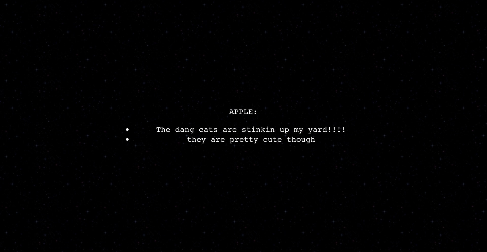

# Overview

- [Performance Structure](#performance-structure)
- [User Interface](#user-interface)

## Performance Structure

An Intrapology performance typically has the following components:

### Live Video Stream

A video stream where audience members can see and hear your actors.

### Moderator

A member of your crew who controls the pace of the performance. The Intrapology software handles displaying current dialogue to performers, and collecting audience input. However, the software needs [input from the moderator](#performance-controls) to know when to advance to the next line of the script.

### Actors

People who will be portraying characters in the performance. Each actor gets their own page of the [Actor View](#actor-view), which displays the current line, if any, for their character.

### Audience Input

The audience [plays an active role](#audience-input) in the flow of the performance. The audience interacts through multiple-choice questions and responding to free-response prompts.

## User Interface

During a performance, the Intrapology software provides four different views:

1. [Audience View](#audience-view)
2. [Subtitles View](#subtitles-view)
3. [Moderator View](#moderator-view)
4. [Actor View](#actor-view)

### Audience View

The audience view is available at the ‘base’ URL where your performance is being hosted. For example: if you host the performance at `http://my-online-performance.website`, then the audience view will be available at that URL.

The audience view has two sections:

1. **The video feed area**: Displays [the video feed](./04_additional-technical-topics.md#videocallembedlink) for the performance.
2. **The audience input area**: This is where audience members can select options during a multiple-choice vote. This is also where audience members can write anything they would like during an audience free-response section. When audience input is not being accepted, some placeholder text will be displayed. The default placeholder text is “You don't have to do anything right now - just sit back and enjoy the show!”. You can change the placeholder text to something else by changing the value of the [`"defaultAudienceMessage"`](./04_additional-technical-topics.md#defaultaudiencemessage)[ option](./04_additional-technical-topics.md#defaultaudiencemessage) in `intrapology-hello-world/settings.json`.

![An annotated screenshot of the Intrapology audience view. The performance video feed is described by VoiceOver as “[Performance Video Stream Title] - YouTube, frame”.](./media/ui_audience_annotated.jpeg)

During an audience vote, the input section will contain a text prompt, and buttons for voting. The text for each option button includes the number of votes which that option has received. The button for the option which currently has the most votes will be tagged with a “⭐️ winning” label. The vote counts and winning tag are updated in real time. If an audience member has selected an option, then its relevant button will be tagged with a “✅ selected” label.

![A screenshot of the Intrapology audience view during an audience multiple-choice vote. The audience input area of the view includes some text prompting the audience for input (in this screenshot, the text is “What should be our next topic of discussion?”), followed by buttons to vote for one of the available options. Each button is labelled with text describing the option that the button is for. The text for the winning option will be prefixed with “⭐️ winning”, and the text for the option the audience member has currently selected will be suffixed with “✅ selected”.](./media/ui_audience_vote.jpeg)

During audience free-response, the input section of the audience view will present audience members with a message prompting them to write about something, and a text input box in which to write. Below the input box is a bulleted list of the text submissions from all audience members. The list of text submissions updates in real time.

### Subtitles View

The subtitles view is available at `<base-url>/#subtitles`. So if you are hosting the performance at `http://my-online-performance.website`, then the subtitles view will be accessible via `http://my-online-performance.website/#subtitles`.

The subtitles view provides subtitles for the performance, generated directly from the script. The name of the current speaker is displayed, along with the dialogue they are speaking.

### Moderator View

The moderator view is available at `<base-url>/#moderator`. So if you are hosting the performance at `http://my-online-performance.website`, then the moderator view will be accessible via `http://my-online-performance.website/#moderator`.

Accessing the moderator view requires entering a password. The password is “butts” by default, but you can [set a different password](./04_additional-technical-topics.md#modpassword).

The moderator view contains the following sections:

1. Current line: shows the current line of dialogue, along with the name of the character speaking.
2. Current choices (during an audience multiple-choice vote): shows the choices available to the audience as well as how many votes each option has, updated in real time.
3. Performance controls: provides the moderator with a “Next line” button to advance the performance to the next line of dialogue, and a “Start over” button which starts the performance over from the beginning.
4. Current rant content (during audience free-response): displays a bulleted list of free-response text submissions from audience members, updated in real time.

Here is an example of the moderator view during audience free-response:

### Actor View

The actor view is available at `<base-url>/#caller`. So if you are hosting the performance at `http://my-online-performance.website`, then the actor view will be accessible via `http://my-online-performance.website/#caller`.

When `<base-url>/#caller` is first visited, the user will be prompted to select which character they are performing:

Upon choosing a role, the actor will be shown a view with two sections:

1. Current line: the topmost portion of the actor view displays either the current line of dialogue that the actor should be performing, or “--” in the case that it is the turn of a different performer to speak. If the actor is assigned to read the results of an audience free-response, the current line display will take the form of a bulleted list of audience submissions.
2. Upcoming: below the current line display is a preview of the upcoming lines for all characters.

Here is an example of what the actor for the character named “Apple” sees when another character is speaking:

And here is an example of what the actor for the character named “Apple” sees when performing audience free-response submissions:

### Demonstration

Here is an example run-through of the sample script (included as `script.ink` with the Intrapology Hello World). This demo shows how the moderator view (top left), audience view (top right), and actor views (bottom left and right) change as the performance progresses:

[Demonstration of running sample script](https://github.com/user-attachments/assets/2e52d864-066f-41e6-955b-4d931011e715)