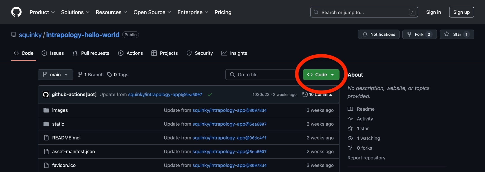
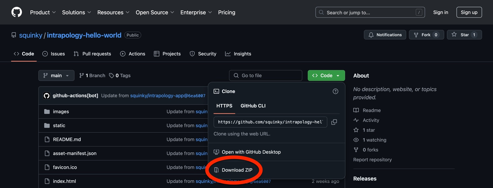
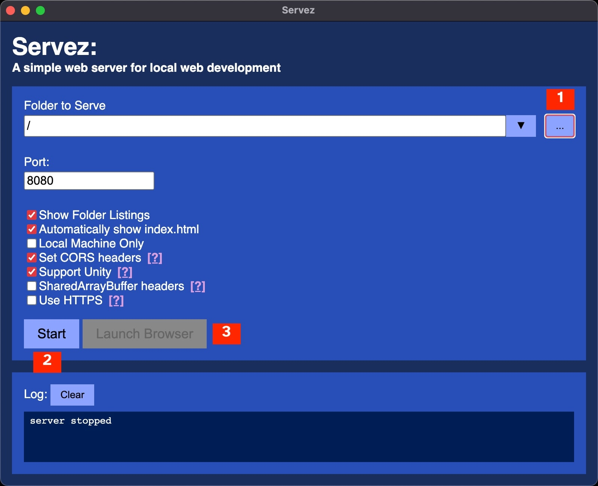
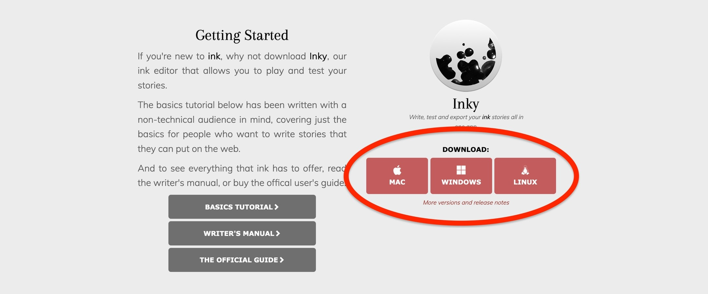

[(Click here for main table of contents)](../README.md)

# Getting Started With the Intrapology Software

- [Downloading the Starter Template](#downloading-the-starter-template)
- [Basic Configuration](#basic-configuration)
- [Testing a Performance on Your Computer](#testing-a-performance-on-your-computer)
- [Installing Inky](#installing-inky)

Here we will walk you through the setup needed to edit and test Intrapology performances.

## Downloading the Starter Template

The Intrapology starter template can be found at [https://github.com/squinky/intrapology-hello-world](https://github.com/squinky/intrapology-hello-world). To download the template, first click the green button labeled “Code” (circled in red below):



Once you have clicked the “Code” button, a box will appear below the button. At the very bottom of the box will be a link labeled “Download ZIP” (circled in red below):



Click the “Download ZIP” link. When the ZIP file is finished downloading, extract it somewhere on your computer. For this guide it will be assumed that the folder is named “intrapology-hello-world”.

## Basic Configuration

Many aspects of your performance can be configured by editing the `settings.json` file found in the `intrapology-hello-world` folder. To get a basic starter performance up and running, we will only be going over a couple of the available options. For details on all available configuration options, go to: [Configuration (settings.json)](./04_additional-technical-topics.md#configuration-settingsjson).

### Editing Settings

If you are not used to editing `.json` files, then settings.json may seem like something that only computer wizards can understand. Do not worry. `settings.json` is really just a text file with a list of settings separated by commas. You can open and edit this file with any app that can edit text (such as Notepad on Windows and TextEdit on MacOS).

In general, settings are specified in the `settings.json` file with this format:

```json
"OPTION NAME": "OPTION VALUE",
```

Open `settings.json` in a text editor of your choice, and we will take a look at a couple of important settings.

### Performance ID

The ‘ID’ of your performance is a unique name that is used to distinguish it from other performances. The performance ID is not the title of your performance that is shown to the audience. For setting the title text of your performance that will be displayed in the audience view, see [this section](./04_additional-technical-topics.md#title).

The performance ID is used by the Intrapology software to keep track of the current state of your performance. This includes the current line of dialogue, and audience voting selections. It is very important that you set a unique ID for your performance. Your performance will not function as expected if it has the same ID as another performance.

By default, the performance ID is specified on line 2 of `settings.json`:

```json
"performanceId": "hello-world",
```

This line specifies that the setting called `"performanceId"` should have the value `"hello-world"`. However, it is not safe to use the default setting. Change the text `hello-world` between the quotes to something else. Make sure to use something that you are certain nobody else will choose as an ID for their performance. The longer and more particular your ID is, the better.

> [!IMPORTANT]
> Your performance ID should not contain any whitespace characters (spaces, tabs, line returns, etc).

### Character Names

The other option which must be set properly in order for your performance to work is `"callers"`. The `"callers"` setting is used to specify the names of characters which have dialogue.

> [!NOTE]
> You do not need to change the `"callers"` setting if you will be following the script writing tutorial. The characters in the tutorial script are included by default in  `settings.json`. However, it is important to know how to set character names for your own scripts.

On line 5 of `settings.json` is the following:

```json
"callers": [ "Apple", "Banana" ],
```

This specifies that there are two dialogue-speaking characters: a character named `“Apple”`, and a character named `“Banana”`. When setting your own character names, be careful to follow these formatting requirements:

1. The list of names must be surrounded by a pair of square brackets `[]`.
2. The names in the list must be separated by commas.
3. Each name must be in double quotes.
4. Each name should be capitalized exactly the same in `settings.json` and in your script.

**Examples:**

|  | Correct ✅ | Incorrect ❌ |
| --- | --- | --- |
| 1. Square Brackets around Names List | `"callers": ["Apple", "Banana"],` | `"callers": "Apple", "Banana",` |
| 2. Commas between Names | `"callers": ["Apple", "Banana"],` | `"callers": ["Apple" "Banana"],` |
| 3. Names in Double Quotes | `"callers": ["Apple", "Banana"],` | `"callers": [Apple, Banana],` |
| 4. Capitalization | `"callers": [ "Apple", "Banana" ],` in `settings.json`, `Apple` with capital “A” in script. | `"callers": [ "Apple", "Banana" ],` in `settings.json`, `apple` with lowercase “a” in script. |

## Testing a Performance on Your Computer

Our software is designed to run on a web server on the internet. But with a small bit of setup, it is possible to do test runs of performances on your own computer.

To run the Intrapology software on your computer, you will need to install a program that runs a server ‘locally’. This guide will show you how to use an app called Servez for this purpose.

To download the Servez installer, go here: [https://github.com/greggman/servez/releases/latest](https://github.com/greggman/servez/releases/latest). If you are unsure which version to download, follow these guidelines:

- If you are using Windows, download “Servez.Setup.\<version\>.exe”
- If you are using MacOS:
    - If you are using an Apple Silicon Mac, download “Servez-\<version\>-arm64.dmg”
    - If you are using an Intel Mac, download “Servez-\<version\>.dmg”
    - If you are unsure which kind of Mac you have, download “Servez-\<version\>-universal.dmg”
- If you are using Linux:
    - If you are using Ubuntu, you probably want to download "Servez_\<version\>_amd64.snap”
    - Otherwise, you probably want to download “Servez-\<version\>.AppImage”. Instructions for how to run an AppImage can be found here: [https://docs.appimage.org/introduction/quickstart.html#ref-quickstart](https://docs.appimage.org/introduction/quickstart.html#ref-quickstart).

Once installed, open Servez. Then, do the following (the image below is annotated to show where buttons are located):

1. Click the “…” button under the “Folder to Serve” heading, located near the top right corner of the app window. A file window will open. Find your `intrapology-hello-world` folder and select it.
2. Click the “Start” button, located towards the bottom left corner of the app window.
3. Click the “Launch Browser” button, located next to the “Start” button. This should open the [audience view](./01_overview.md#audience-view-example) of the template performance in your web browser.

<p width="100%" align="center">
    <a target="_blank" href="./media/servez_annotated.jpeg">
        
    </a>
</p>

Feel free to close Servez for now. You will not need to run it again until later in this guide. Servez will remember the Intrapology folder you selected. From now on you will only need to click “Start” and then “Launch Browser” in order to test.

## Installing Inky

To work with Intrapology performance scripts, you will need an app called Inky. To get Inky, go to this page: [https://www.inklestudios.com/ink/](https://www.inklestudios.com/ink/), and scroll down to the “Getting Started” section (pictured below). Click the appropriate download button for your computer to download the Inky installer.

