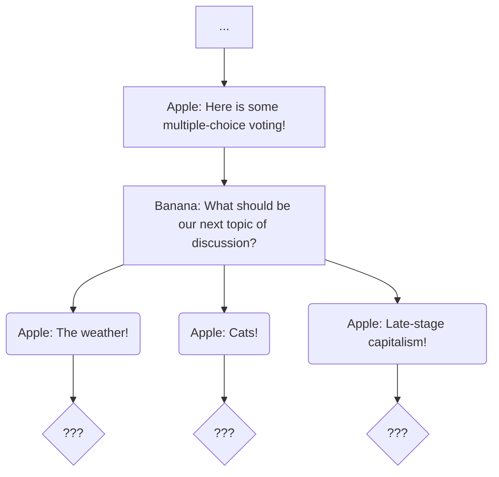
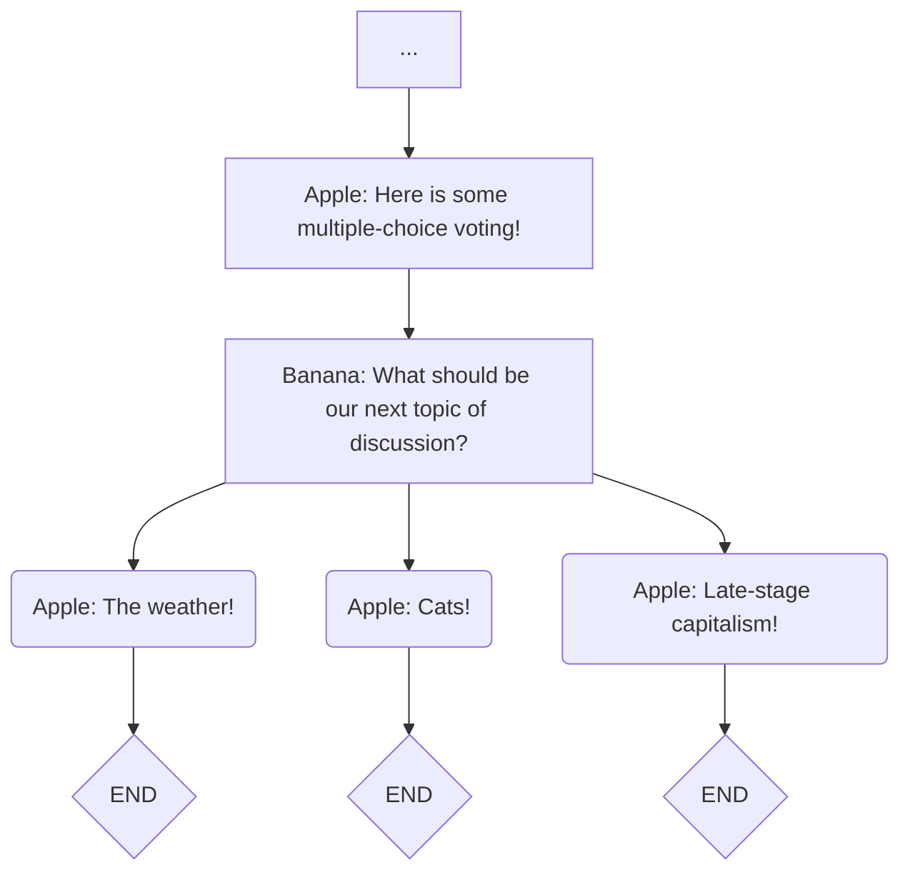
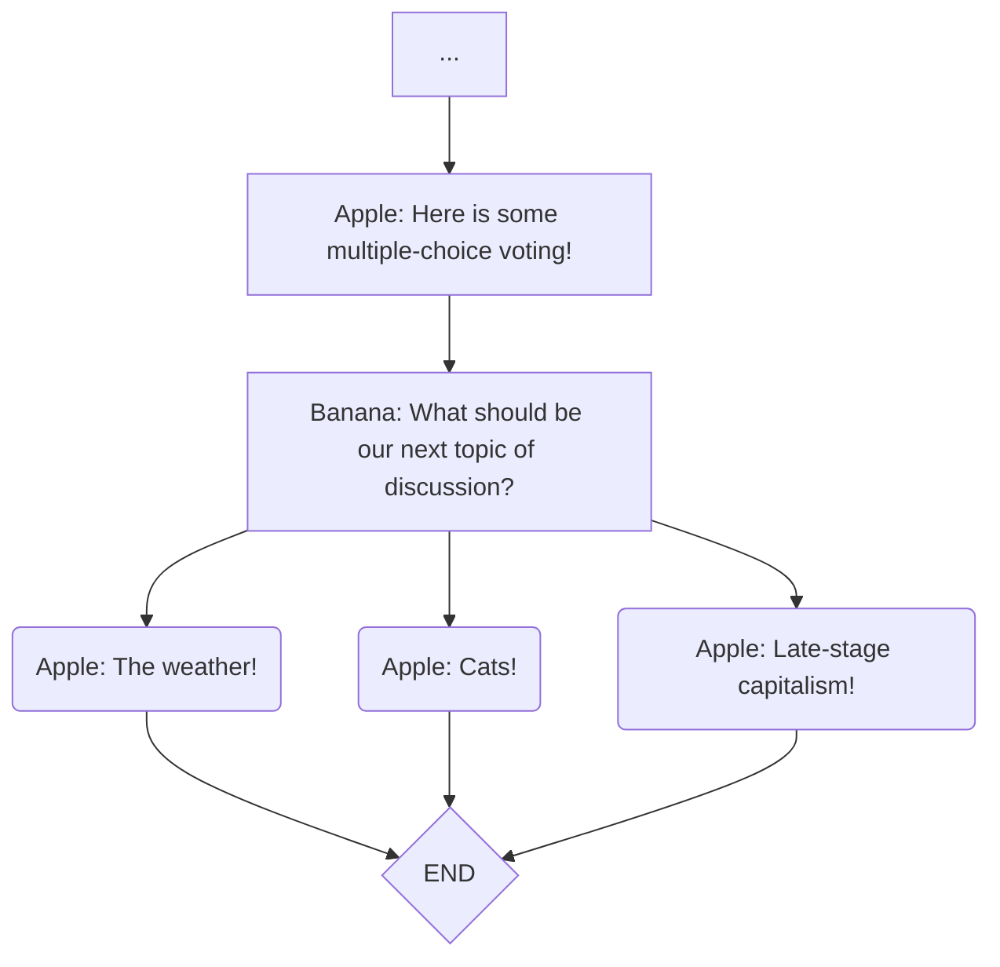

# Writing an Intrapology/Ink script

- [Basics](#basics)
- [Interactivity](#interactivity)
- [Conclusion](#conclusion)
- [Summary](#summary)

## Basics

Intrapology scripts use a format called [Ink](https://www.inklestudios.com/ink/). Ink is like the human language that you are used to writing in, but with some extra rules for grammar and punctuation. This section will walk you through the process of writing a minimal script. If you would prefer to learn by reading a list of the grammar and punctuation rules, skip to this section: [Summary](#summary).

A basic functioning Intrapology script involves the following elements:

1. [Knots](#knots)
2. [Dialogue](#dialogue)
3. [Diverts](#diverts)

which are explained in this guide.

### Setup

Open Inky. You will see the default starter Ink script contents in the editor panel (the left half of the window). Delete all text except for the line with `-> END`, then save this new script (”File” menu → “Save Project”) as `tutorial-script.ink` in your `intrapology-hello-world` folder.

> [!TIP]
> Throughout the “Writing an Intrapology/Ink script” guide, you will be instructed to add text to your tutorial script. When adding text, try to do so by typing the text yourself rather than copying and pasting. This will help your brain to process and retain the information being covered.

### Knots

Add the following line to the beginning of your script:

```
== Start
```

`==` followed by a name is a “knot heading”, which means: ‘the knot with this name begins here’. A “knot” is a piece of your script that can be referred to by name; you can think of a knot as a section or scene.

An Intrapology script needs at least one knot to function. You can name the knot anything you like in your scripts, but for this guide we use the name “Start”.

### Diverts

In order to function properly, every Intrapology script requires two special statements:

1. A statement telling the software where to begin the performance
2. A statement telling the software where to end the performance

Add the following text on its own line at the beginning of the script (before the `== Start` heading):

```
-> Start
```

In Ink, writing `->` followed by a name means: ‘now go to the knot with this name’. This is called a “divert”. Every Intrapology script must begin with a divert specifying which knot to start the performance with (even if the script only has one knot). The divert above tells the Intrapology software that your performance starts with the knot named “Start”.

The `-> END` divert present at the end of the “Start” knot tells the Intrapology software that once the “Start” knot is finished, the performance should end. Note that you do not need to have a knot named `END`. `END` is a special built-in key word which does not refer to a knot in your script.

> [!TIP]
> It is best that whenever you add a new knot to your script, you are sure to do the following:
> 1. End the knot with a divert either to `END` or to another knot.
> 2. Consider which other knot(s), if present, should divert to this new knot. Then add the associated diverts as soon as possible
> 
> This will reduce the likelihood of unexpected problems later.

Your script file should look like this now:

```
-> Start

== Start

-> END
```

Without any content, this is not a very interesting script. Luckily, adding dialogue is the next order of business.

### Dialogue

To add some dialogue to the script, add the following at a new line under the `== Start` heading and before the `-> END` divert:

```
Apple: Hi, I'm the first video caller!
Banana: Hi, I'm the second video caller!
```

Writing the name of a character (in this case `Apple` or `Banana`), followed by a colon `:`, followed by some text, means: ‘the character with this name says this text’. When each line of dialogue is reached during a performance, the Intrapology interface will show it to the relevant performer. The [Subtitles View](./01_overview.md#subtitles-view) will show the line of dialogue as well. The moderator view also displays the current line of dialogue.

> [!WARNING]
> Remember: all characters with dialogue in your script must be listed via the [`"callers"`](./04_additional-technical-topics.md#callers)[ option](./04_additional-technical-topics.md#callers) in `settings.json`. Since `“Apple”` and `“Banana”` are specified by default in the Intrapology Hello World template, no action is required for for now. However, if you write a script with different character names, you will need to update `settings.json`.

At this point, the contents of your script file should look like this:

```
-> Start

== Start

Apple: Hi, I'm the first video caller!

Banana: Hi, I'm the second video caller!

-> END
```

This is enough to use for a trial run with the Intrapology software.

### Running the Performance Locally

If you have not already done so, [set a unique Performance ID](./04_additional-technical-topics.md#performance-id) and [install and set up Servez](./02_getting-started-with-the-intrapology-software.md#testing-a-performance-on-your-computer) before continuing.

1. First you need to ‘export’ the script to a file format that the Intrapology software can use. To do so, go to the “File” menu and click the item labelled “Export to JSON…”. Name the exported file `script.json` (make sure you aren’t using the default name `script.ink.json`) and save it in your `intrapology-hello-world` folder.
2. Open Servez and click the “Start” button.
3. Click the “Launch Browser” button, which will open the Audience View in your web browser. Make a note of the URL in the address bar (it will be something like `localhost:8080`), you will need it for the next step. It will be referred to from here on as `<base url>`.
4. Go to the following additional pages, each in a separate web browser window:
    1. Go to `<base-url>/#caller` and select “Apple”
    2. Go to `<base-url>/#caller` and select “Banana”
    3. Go to `<base-url>/#moderator` and enter the default password, ”butts”, unless you have changed the password to something else.

You should now be able to use the Moderator View to step through the performance so far. Here is a screen recording of what this should look like (minus the Audience View):

https://github.com/user-attachments/assets/1721c86d-7c13-4c4b-9b25-72184527fd98

When you are ready to move on, simply close the browser windows, click the “Stop” button in Servez, and exit Servez.

## Interactivity

The key elements of building interactive performances are:

1. [Multiple-Choice Audience Input](#multiple-choice-audience-input)
2. [Flow and Choice Branching](#flow-and-choice-branching)
3. [Gathers](#gathers)
4. [Free-Response Audience Input](#free-response-audience-input)
5. [Variables](#variables)

### Multiple-Choice Audience Input

After this line:

```
Banana: Hi, I'm the second video caller!
```

and before the `-> END`, add the following to your script:

```
== MultipleChoice

@What should be our next topic of discussion?

Apple: Here is some multiple-choice voting!

Banana: What should be our next topic of discussion?

* Apple: The weather!
* Apple: Cats!
* Apple: Late-stage capitalism!
```

(After this change, you will likely see a ⚠️ symbol at the left edge of the Inky window. We will deal with this shortly.)

To have an audience multiple-choice vote, a script must have the following:

1. A block of text prefixed with the `@` symbol. This text will be shown to the audience at the top of [the audience view](./01_overview.md#audience-view) UI during the voting period. The placement of this block of text determines when the audience vote UI becomes visible.
2. A set of choices for the audience to vote on. An `@` block will be associated with the closest group of choices below the `@` text. A choice is prefixed with the `*` symbol. Each choice should be on its own line.

During a performance, the audience will be presented with the choice UI once the `@` has been reached. When this happens, a title with the text "What should be our next topic of discussion?" will be displayed, as will 3 buttons, each having, respectively, the following text:

- "Apple: The weather!"
- "Apple: Cats!"
- "Apple: Late-stage capitalism!"

The choice with the most votes becomes the next line of dialogue for the character `Apple`.

> [!NOTE]
> The voting UI will remain visible to the audience until the choice group has been reached.

> [!TIP]
> You can use `*` or `+` for choices. For Intrapology these two options have the same meaning. But in other uses of Ink, `*` and `+` work differently. We recommend using `*` in general, since it works the same in both Ink and Intrapology, whereas `+` has a special meaning outside of Intrapology.

### Flow and Choice Branching

At this point we need to discuss the concepts of **flow** and **choice branching**.  'Flow' is a term used to describe the path taken through an Ink/Intrapology script. The script itself is a static document in which all content is present at once. But a live performance proceeds (flows) through the script one bit at a time. The flow of a performance is the collection of sequenced steps through the source script. Before adding the multiple choice section, we had written a script with a single possible flow. The sequence of steps in a performance of the script would have been the same every time. However, with the addition of audience choices, we now have a script which has more than one possible flow. When the audience selects a choice, the performance flow will follow a 'branch' for that choice. The diagram below visualizes the diverging possible flows of the script:



The diagram shows each choice branch leading to a different "???". There are two important points which need to be noted here:

- With Ink/Intrapology scripts, each individual choice is the start of its own branch of the flow. Each choice leads to a next step which is distinct from the steps of its 'sibling' choices. This is why the diagram shows each choice having its own outgoing arrow. What comes after a choice is the content written between that choice and the next choice. An example of this will be given shortly.
- Each choice leads to a next step, but our script so far does not specify what happens next for any of the choices. Any choice which does not lead to anything else is a dead end, which is not allowed. Such a choice leads to a scenario where the flow has nowhere left to go, even though an `-> END` divert has not been reached. So it is required to specify what should happen after each choice. Every choice must be followed by *something*, even if that something is simply `-> END`. Luckily, Inky will display a warning when there is a choice which leads to a dead end.

> [!NOTE]
> Ink requires that every possible user flow leads to a `-> END`. In cases where flow can run out before a `-> END`, Inky will highlight the relevant line of text with a ⚠️ symbol on the left edge of the window. This warning message will be included: “Apparent loose end exists where the flow runs out.”

To appease the computer, we can amend our recently added group of choices like so:

```
* Apple: The weather!
  -> END
* Apple: Cats!
  -> END
* Apple: Late-stage capitalism!
  -> END
```

> [!TIP]
> Choice branch content does not need to be indented (as it is in the above snippet). However the use of indentation can make the script easier to read at a glance.

Now the performance will properly end if any of the listed choices are selected. The diagram below depicts the flow options for this updated script:



Content directly below a choice indicates what should come after that choice. Completely unique branches can be written this way. For example, with the following (do not add this to your script):

```
* Apple: The weather!
  Banana: Its lovely right now!
  -> SomeKnot
* Apple: Cats!
  Banana: Some of my best friends are cats.
  -> SomeOtherKnot
* Apple: Late-stage capitalism!
  Banana: All that was solid has melted into air.
  -> YetAnotherKnot
```

it would be the case that if the `Apple: Cats!` line is selected, the performance would next proceed with the line `Banana: Some of my best friends are cats.`, and then the performance would divert to the knot titled `SomeOtherKnot`. The content for the other two choices would not be included in that performance.

### Gathers

Writing shared outcomes for groups of choices can be tiresome when having to write the same thing after each choice. For these kinds of situations, Ink provides something called a 'gather'. Instead of having a dedicated `-> END` after each choice, write the following:

```
* Apple: The weather!
* Apple: Cats!
* Apple: Late-stage capitalism!

- -> END
```

Placed after a set of choices, the `-` symbol followed by space and then some content is a **gather**, which has the meaning: 'after the flow from any choice branch of the above group has concluded, the following content is next'. You can think of a gather as a way of 'un-branching' back to a singular flow sequence after a set of choices has branched the flow. With the use of a gather, the flow can now be represented by this diagram:



Diverts and dialogue are both legal kinds of content for a gather.

### Free-Response Audience Input

The Intrapology software also offers a way to collect ‘free-response’ style audience input and incorporate it into a performance.

First, replace this line (at the end of the “MultipleChoice” knot):

```
- -> END
```

With this:

```
- -> WriteIn
```

Next, add the following to the end of your script:

```
== WriteIn

@Write any thoughts you have about the topic here.

Apple: Now it's time for some fun with write-in options!

Banana: The audience is going to type stuff in and you are going to read it all!

Apple: That's right!

Apple: Firebase-read

+ z

Banana: That's all, folks!

-> END
```

In a knot with an `@`-prompt line and a line of dialogue with the exact text: `Firebase-read`, the audience will be prompted to write whatever they would like into a text box. Once the `CHARACTER: Firebase-read` line is reached, the relevant performer will be shown a list of the responses from each audience member. In this instance, audience members would be presented with the prompt “Write any thoughts you have about the topic here.”, and the performer for `Apple` will be shown the audience responses.

> [!NOTE]
> The write-in prompt will remain visible until another audience input line is reached. This is why we have added `+ z` (a fake choice which the audience will not be presented with): to cause the write-in prompt to go away before the next line.

### Variables

Another important element of dynamic performances is a set of functionality relating to ‘Variables’. Variables are like boxes that can be used to hold information. Variables have names, allowing to you keep information organized. Existing variables can have new information put in them, so they are a great way to keep track of and use information that depends on audience input or random events. 

**Creating Variables**

Add the following to the very beginning of your script (before the `-> Start`):

```
VAR topic = "nothing"
VAR excitementLevel = 1
```

There are several things to note here:

- `VAR someVariable = 0` tells the computer that you would a variable named “someVariable” to exist, and that it should start out containing the value `0`.
- Variable names cannot contain spaces. `excitement level` is not a legal name for a variable.
- Variables must be created before they can be used. If you try to use the variable named `topic` on a line before `VAR topic = ...` has been specified, the computer will not know what to do.
- Variables can store different kinds of information, such as text (which must between double quotes) and numbers.

**Using Information Stored in Variables**

Replace this line (in the “WriteIn” knot):

```
@Write any thoughts you have about the topic here.
```

with this:

```
@Write any thoughts you have about {topic} here.
```

In a line of text, placing the name of a variable between curly brackets (`{` and `}`) tells Ink/Intrapology to insert whatever is stored in the variable at that part of the line. So when running a performance of the script so far, when the line we have just added is reached, the audience will be presented with “Write any thoughts you have about nothing here.”, since the variable named `topic` has been given the value “nothing”. This can be used in a line of dialogue as well.

**Updating Variables**

Right below this line (near the top of your script):

```
VAR excitementLevel = 1
```

add the following line:

```
~ excitementLevel = 2
```

`~` followed by the name of a variable which has previously been created, followed by `=` and a value tells the computer to replace the current value contained in the variable with a new one. In this case, `excitementLevel` contains the value `1` until we update it with `2` on the line below. For the rest of the script, the value contained in `excitementLevel` is 2. Since this example is somewhat abstract, it is likely not yet clear what the purpose for doing this is, but the next example will show a specific practical use case for setting variable values.

Modify the choice group found in the “MultipleChoice” knot:

```
* Apple: The weather!
* Apple: Cats!
* Apple: Late-stage capitalism!
```

so that it is like this:

```
* Apple: The weather!
    ~ topic = "the weather"
* Apple: Cats!
    ~ topic = "cats"
* Apple: Late-stage capitalism!
    ~ topic = "late-stage capitalism"
```

Note that now information is being stored in the `topic` variable which depends on the result of the audience vote. With this change, the contents of the prompt for this line:

```
@Write any thoughts you have about {topic} here.
```

will depend on what the audience has voted for earlier in the performance. Storing differing values in a variable depending on the selected choice branch, and then using that variable later in the script, is a technique which can increase the degree to which a performance changes in response to audience input. For example, you can also incorporate variables into dialogue, like this:

```
Banana: All I've been able to think about lately is {topic}.
```

Variables can also be used for much more. To learn about the more advanced uses of variables, read this section of the official Ink documentation: [https://github.com/inkle/ink/blob/master/Documentation/WritingWithInk.md#1-global-variables](https://github.com/inkle/ink/blob/master/Documentation/WritingWithInk.md#1-global-variables).

## Conclusion

Your script should now look like this:

```
VAR topic = "nothing"
VAR excitementLevel = 1
~ excitementLevel = 2

-> Start

== Start

Apple: Hi, I'm the first video caller!

Banana: Hi, I'm the second video caller!

-> MultipleChoice

== MultipleChoice

@What should be our next topic of discussion?

Apple: Here is some multiple-choice voting!

Banana: What should be our next topic of discussion?

* Apple: The weather!
    ~ topic = "the weather"
* Apple: Cats!
    ~ topic = "cats"
* Apple: Late-stage capitalism!
    ~ topic = "late-stage capitalism"

- -> WriteIn

== WriteIn

@Write any thoughts you have about {topic} here.

Apple: Now it's time for some fun with write-in options!

Banana: The audience is going to type stuff in and you are going to read it all!

Apple: That's right!

Apple: Firebase-read

+ z

Banana: That's all, folks!

->END
```

## Summary

- **Knots**: `== Start` is a “knot heading”, which means ‘the knot (section) named `Start` begins here’. To learn more, go here: [https://github.com/inkle/ink/blob/v.1.2.0/Documentation/WritingWithInk.md#3-knots](https://github.com/inkle/ink/blob/v.1.2.0/Documentation/WritingWithInk.md#3-knots)
- **Dialogue**: `Apple: Hi, I'm the first video caller!`  means ‘the character named `Apple` says “Hi, I’m the first video caller!”’. This will be shown to the performer for the `Apple` character via their [Actor View](./01_overview.md#actor-view).
- **Diverts**: `-> Start` means ‘go to the knot named `Start`’
    - You must begin your script with a divert telling Intrapology which knot to go to first.
    - You must have at least one `-> END` divert telling Intrapology where the performance ends. Inky will warn you if you are missing this.
    - To learn more, go here: [https://github.com/inkle/ink/blob/v.1.2.0/Documentation/WritingWithInk.md#4-diverts](https://github.com/inkle/ink/blob/v.1.2.0/Documentation/WritingWithInk.md#4-diverts)
- **Multiple-choice Audience Input**:
    
    ```
    @What should be our next topic of discussion?
    
    * Apple: The weather!
    * Apple: Cats!
    * Apple: Late-stage capitalism!
    ```
    
    means ‘show the audience a choices box’ which
    
    - Is labeled “What should be our next topic of discussion?”
    - Has the following options to vote for the next line of dialogue: `Apple: The weather!`, `Apple: Cats!`, and `Apple: Late-stage capitalism!`
    
    The option which receives the most votes will be shown to the performer for `Apple`.
    
    To learn more, go here: [https://github.com/inkle/ink/blob/v.1.2.0/Documentation/WritingWithInk.md#2-choices](https://github.com/inkle/ink/blob/v.1.2.0/Documentation/WritingWithInk.md#2-choices)
    
- **Free-Response Audience Input**:
    
    ```
    @Write any thoughts you have about cats here.
    
    Apple: Firebase-read
    ```
    
    In a knot with an `@`-prompt line and a line of dialogue with the exact text: `Firebase-read`, the audience will be prompted to write whatever they would like into a text box. Once the `CHARACTER: Firebase-read` line is reached, the relevant performer will be shown a list of the responses from each audience member.
    
- **Variables**:
    - **Creating a variable**: `VAR topic = "nothing"`  means ‘create a variable named `topic` which for now has the value `"nothing"`'.
    - **Changing the value of a variable**: `~ topic = "cats"` means ‘the variable named `topic` now has the value `"cats"`'.
    - **Including the value of a variable**: `{topic}` means insert the current value of the variable named `topic` here’. This works in dialogue as well as audience prompts and choices.
    - Example:
        
        ```
        VAR topic = "nothing"
        
        ~ topic = "cats"
        
        Apple: I can't stop thinking about {topic}!
        ```
        
        When the line of dialogue above is reached during a performance, the performer for `Apple` will be shown the line: “I can't stop thinking about cats!”.
        
        To learn more, go here: [https://github.com/inkle/ink/blob/v.1.2.0/Documentation/WritingWithInk.md#part-3-variables-and-logic](https://github.com/inkle/ink/blob/v.1.2.0/Documentation/WritingWithInk.md#part-3-variables-and-logic)
        
- **Gathers**:
    - After a group of choices, `- -> SomeKnot` means ‘after a choice is selected, go to the knot named `SomeKnot`’.
    - A gather does not have to include a divert. You can also use a gather for a line of dialogue after choices, for example: `- Apple: Let's move on.`
    - To learn more, go here: [https://github.com/inkle/ink/blob/v.1.2.0/Documentation/WritingWithInk.md#part-2-weave](https://github.com/inkle/ink/blob/v.1.2.0/Documentation/WritingWithInk.md#part-2-weave)