[(Click here for main table of contents)](../README.md)

# Additional Technical Topics

- [Configuration (`settings.json`)](#configuration-settingsjson)
- [Customizations to Visual Presentation (`settings.json` styles)](#customizations-to-visual-presentation-settingsjson-styles)

## Configuration (`settings.json`)

> [!IMPORTANT]
> Configuration items tagged with **[REQUIRED]** must be changed from their default values in order for your performance to work as expected.

### **performanceId**

**[REQUIRED]**

A unique name for your performance. Should not include spaces. Make sure this is something that another performance will not be likely to use (for example, something generic like “performance” or “my-performance” is a bad idea).

### **modPassword**

The password required for access to the moderator view of the app. This is currently set to `"butts"` by default. You do not have to change this for the software to function, but it is probably a good idea to set a different password before running a live performance.

### **title**

A title for your performance that will be displayed to the audience in the performance UI.

### **callers**

**[REQUIRED]**

The names of the characters in your play who will be performed by human actors, in JSON array format: a pair of square brackets `[]` containing a list of names, with each name in double quotes and separated by commas. For example, if your performance has three characters named Ophelia, Rosencrantz, and Guildenstern, then the value for `"callers"` should be `["Ophelia", "Rosencrantz", "Guildenstern"]`.

### **videoCallEmbedLink**

The YouTube URL for your performance video stream.

### **styles**

Change colours, fonts, and backgrounds here. For a list of available options with examples, go to this section: [Customizations to Visual Presentation (settings.json styles)](#customizations-to-visual-presentation-settingsjson-styles).

### **defaultAudienceMessage**

The placeholder message to be displayed to the audience when there is no audience vote or free-response occurring.

## Customizations to Visual Presentation (`settings.json` styles)

The following options are available for customizing the look of the Intrapology UI (follow the ‘type’ link for information about the type of data allowed for that option):

### **desktopBackground**

**Type:** [Background](#background)

This determines the background color/image for the [main area of the Audience View](./01_overview.md#audience-view-main). By default this is set to an animated image of flickering stars.

Here is an example of what the Audience View UI looks like when `desktopBackground` has been set to `fuchsia`:

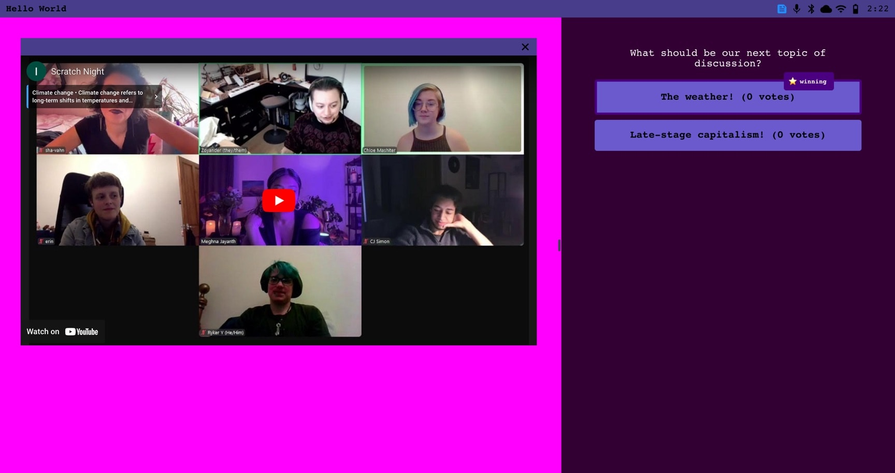

### **interactBackground**

**Type:** [Background](#background)

This determines the background color/image for the [audience input area of the Audience View](./01_overview.md#audience-input). By default this is set to a slightly transparent black.

Here is an example of what the Audience View UI looks like when `interactBackground` has been set to `fuchsia`:

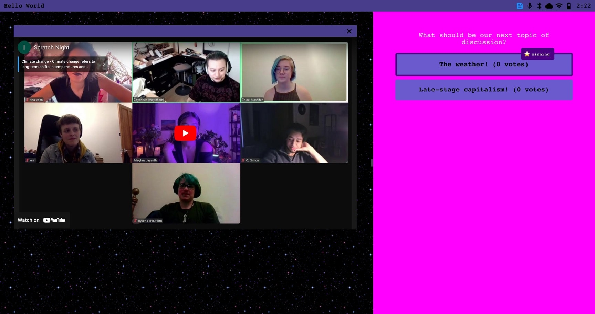

### **mainFont**

**Type:** [Font](#font)

This determines the font for all text in the UI except for subtitles. By default this is set to `Courier`.

Here is an example of what the Audience View UI looks like when `mainFont` has been set to `cursive`:

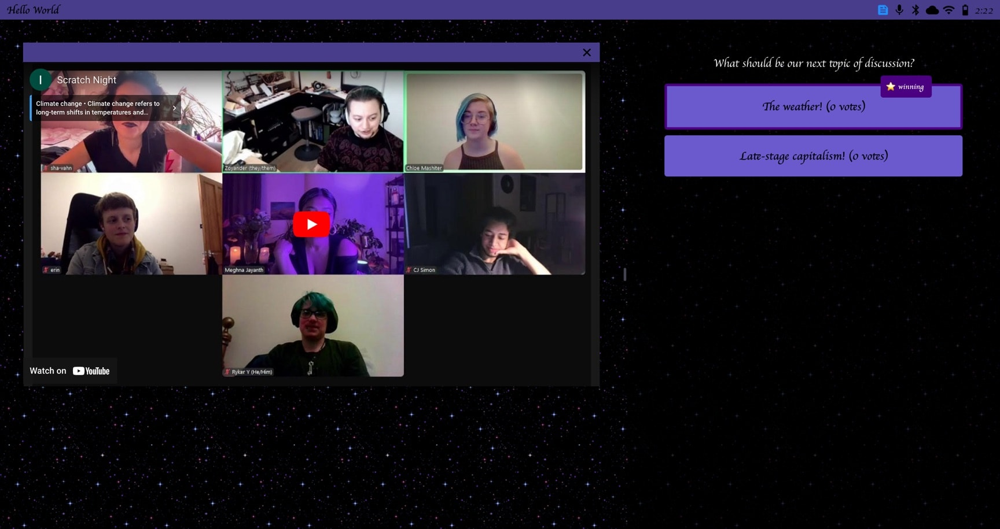

### **mainTextColor**

**Type: **[Color](#color)

This determines the color for:

- Audience View:
    - Input prompt text
    - Input area placeholder text
- Moderator View:
    - All non-button text
- Actor View:
    - Current line text

By default this is set to `white`.

Here is an example of what the Audience View UI looks like when `mainTextColor` has been set to `fuchsia`:

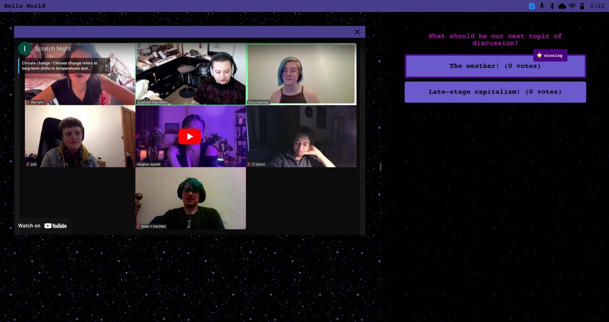

### **taskbarBackground**

**Type: **[Background](#background)

This determines the background for the bar at the top of the Audience View UI, as well as the bar on top of the video feed box. By default this is set to `darkslateblue`.

Here is an example of what the Audience View UI looks like when `taskbarBackground` has been set to `fuchsia`:

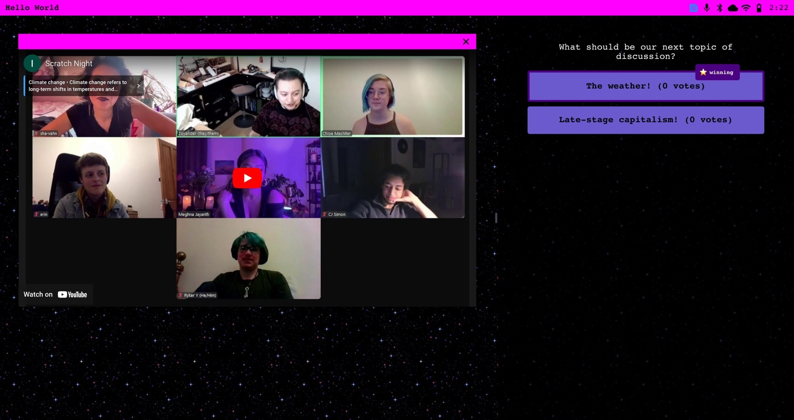

### **taskbarTextColor**

**Type: **[Color](#color)

This determines the color for all text and icons in the taskbar at the top of the Audience View, except for the leftmost icon. By default this is set to `black`.

Here is an example of what the Audience View UI looks like when `taskbarTextColor` has been set to `fuchsia`:

### **taskbarHighlightColor**

**Type: **[Color](#color)

This determines the color for leftmost icon in the taskbar at the top of the Audience View. By default this is set to `dodgerblue`.

Here is an example of what the Audience View UI looks like when `taskbarHighlightColor` has been set to `fuchsia`:

### **buttonBackground**

**Type: **[Background](#background)

This determines the background for all buttons in the UI. By default this is set to `slateblue`.

Here is an example of what the Audience View UI looks like when `buttonBackground` has been set to `fuchsia`:

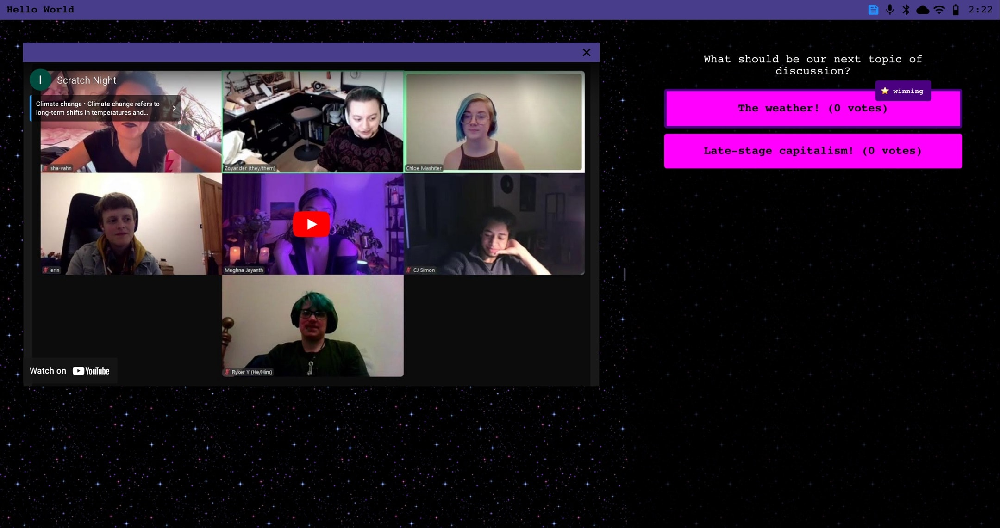

### **buttonBackgroundHover**

**Type: **[Background](#background)

This determines the background for any button that the mouse is hovering over. By default this is set to `dodgerblue`.

Here is an example of what the Audience View UI looks like when `buttonBackgroundHover` has been set to `fuchsia` and the user’s mouse is hovering over the button labelled “The weather! (0 votes)”:

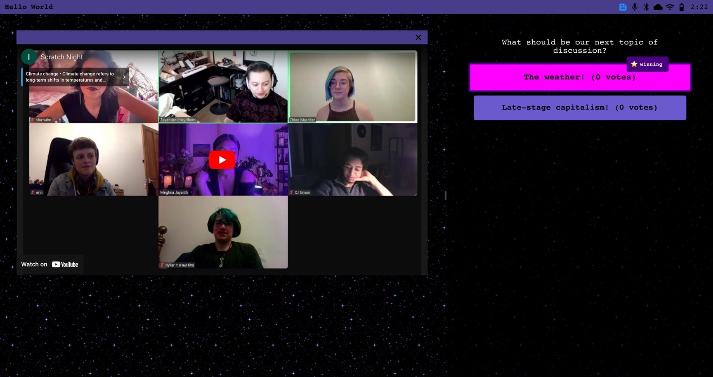

### **buttonTextColor**

**Type:** [Color](#color)

This determines the text color for all buttons in the UI. By default this is set to `black`.

Here is an example of what the Audience View UI looks like when `buttonTextColor` has been set to `fuchsia`:

### **mainHighlightBackground**

**Type:** [Color](#color)

This determines the background color for the “⭐️ winning” tag in the multiple choice mode of the Audience View UI. By default this is set to `indigo`.

Here is an example of what the Audience View UI looks like when `mainHighlightBackground` has been set to `fuchsia`:

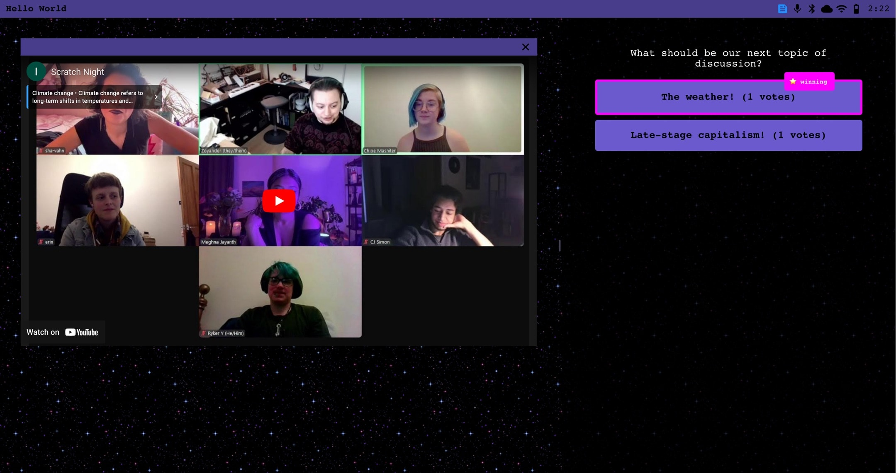

### **altHighlightBackground**

**Type: **[Background](#background)

This determines the background color for the “✅ selected” tag in the multiple choice mode of the Audience View UI. By default this is set to `midnightblue`.

Here is an example of what the Audience View UI looks like when `altHighlightBackground` has been set to `fuchsia`:

### **highlightTextColor**

**Type: **[Color](#color)

This determines the text color for the “⭐️ winning” and “✅ selected” tags in the multiple choice mode of the Audience View UI. By default this is set to `white`.

Here is an example of what the Audience View UI looks like when `highlightTextColor` has been set to `fuchsia`:

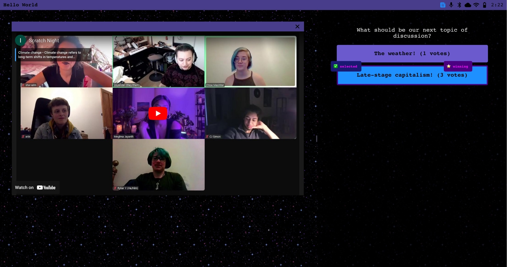

### **subtitlesBackground**

**Type: **[Background](#background)

This determines the background for the Subtitles View. By default this is set to `darkslateblue`.

Here is an example of what the Subtitles View UI looks like when `subtitlesBackground` has been set to `fuchsia`:

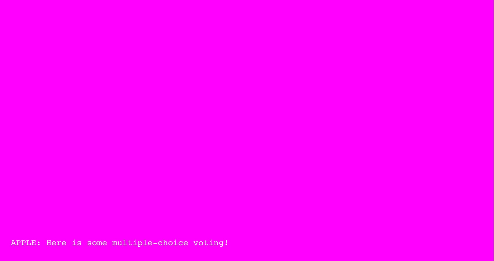

### **subtitlesTextColor**

**Type: **[Color](#color)

This determines the text color for the Subtitles View. By default this is set to `white`.

Here is an example of what the Subtitles View UI looks like when `subtitlesTextColor` has been set to `fuchsia`:

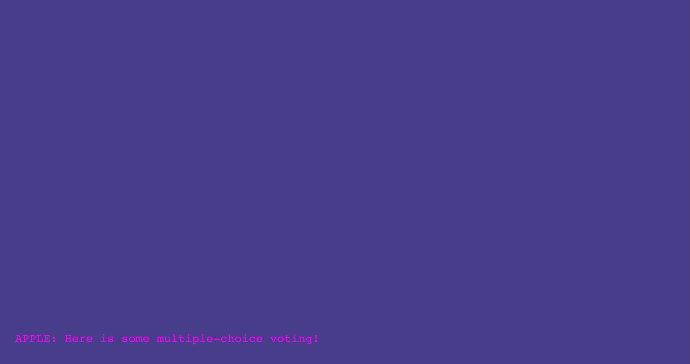